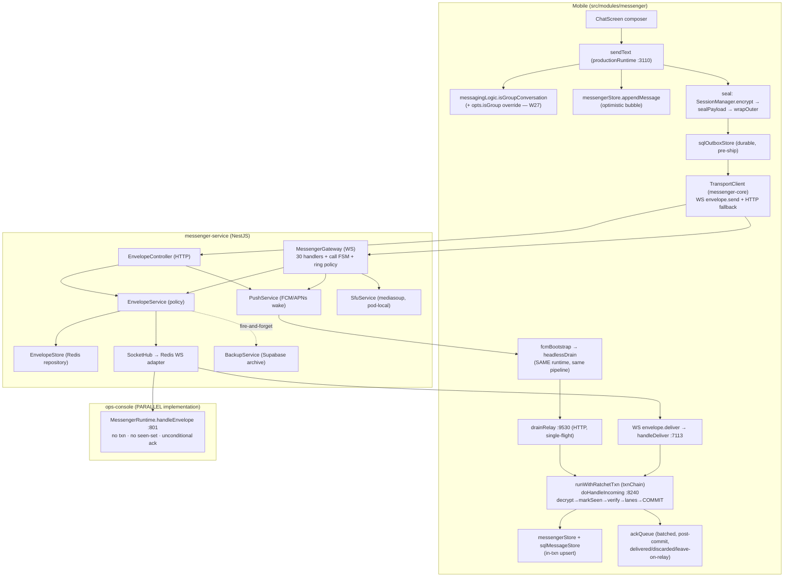
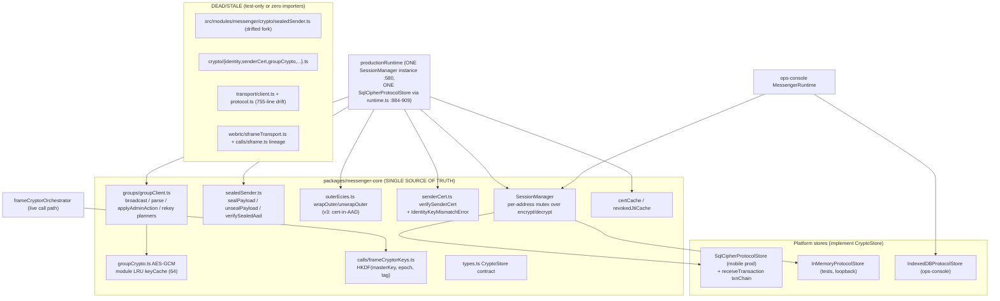

# Messenger + Crypto Deep Architecture Audit

**Date:** 2026-08-13 · **Branch:** `fix/calling-b419-b427` (commit 33954706) · **Mode:** read-only — no code modified.
**Scope:** `apps/messenger-service/src` (NestJS backend, 24.9k LOC), `packages/messenger-core/src` (shared crypto/transport, 9.0k LOC), `src/modules/messenger` (mobile runtime, 68.6k LOC), `src/screens/messenger` (27.1k LOC), plus the ops-console consumer (`apps/ops-console/src/lib/messenger`).
**Method:** five parallel deep-dive audits (backend architecture; crypto layer; send/receive lifecycle trace; shared-state/concurrency; testability/duplication/ID-safety), cross-checked against `docs/runbooks/MESSAGE_LOOP.md` (M1–M16), git churn data, and the code-review graph. Every finding was verified against the actual working tree; line numbers are current as of today (they go stale fast in this repo — re-grep the symbol before acting).

> **Caveat:** a parallel session was actively editing this tree during the audit (the new `productionRuntime*` test suites changed between reads; several `voipWake*` tests named in git status no longer exist on disk). Findings against uncommitted test files reflect on-disk state at read time.

---

## 1. Executive summary

The messenger core is **far more hardened than its file sizes suggest**: the mobile receive path is genuinely transactional (ratchet advance + dedup + plaintext row commit atomically under `BEGIN IMMEDIATE`), floating promises are consistently caught, the serialization machinery (txnChain, owner epochs, in-flight registry, single-flight opens) is sound, and error taxonomies in the crypto layer are unusually disciplined. Verified-sound subsystems are listed in the Appendix — a lot of past pain has been converted into real mechanisms.

The real risk is concentrated in five places:

1. **A protocol-level crypto weakness**: group rekey derives the new master key deterministically from the old one, so a **removed member can compute every future key** — defeating the rekey's own stated purpose (affects group-call media and archives).
2. **The ops-console runs a parallel receive pipeline with none of mobile's guarantees** — unconditional acks (even on transient failure), no seen-set, no transaction. It is the live B-125 data-loss shape, today, on a second platform.
3. **Scale-out is a silent total outage**: 1:1 call sessions and the SFU control plane are pod-local while the WS fan-out is cluster-ready; nothing enforces single-replica.
4. **Two-of-everything drift**: dead forks of the transport client, wire protocol, and five crypto files — several **pinned by tests that appear to be security coverage but exercise dead code**, and a server-side header that directs maintainers to mirror wire changes into the dead copy.
5. **Structural concentration**: one 5,868-line closure (`buildProductionRuntime`) holding nearly all runtime state as closure variables, absorbing 113 fix commits (out of 143 total; 106 commits in the last ~10 weeks alone).

---

## 2. Top 20 highest-risk findings

Ranked. IDs reference the per-dimension sections below. Severity: P0 security/data-loss/outage · P1 correctness/regression · P2 maintainability/debugging · P3 cleanup.

| #   | Sev    | Finding                                                                                                                                                                                                                                                                                                                                                                                                                                                                                                                                                                                                                                                                                                                                                                                                                                                                                                                                                                                                                                                                                                                                                                                                                                                                                                                                                                                                                                                                                                                                                                                                                                                                                                                                                                                                                                                                                                                                                                                                                                                                                                                                                                                                                                                                                                                                                                                                                                                                                      | File                                                                                                                                                                                                                                                                                                                                                                                                                                                                                                                                                                                                                                                                                                                                       | Fix size                                                                                                                   |     |
| --- | ------ | -------------------------------------------------------------------------------------------------------------------------------------------------------------------------------------------------------------------------------------------------------------------------------------------------------------------------------------------------------------------------------------------------------------------------------------------------------------------------------------------------------------------------------------------------------------------------------------------------------------------------------------------------------------------------------------------------------------------------------------------------------------------------------------------------------------------------------------------------------------------------------------------------------------------------------------------------------------------------------------------------------------------------------------------------------------------------------------------------------------------------------------------------------------------------------------------------------------------------------------------------------------------------------------------------------------------------------------------------------------------------------------------------------------------------------------------------------------------------------------------------------------------------------------------------------------------------------------------------------------------------------------------------------------------------------------------------------------------------------------------------------------------------------------------------------------------------------------------------------------------------------------------------------------------------------------------------------------------------------------------------------------------------------------------------------------------------------------------------------------------------------------------------------------------------------------------------------------------------------------------------------------------------------------------------------------------------------------------------------------------------------------------------------------------------------------------------------------------------------------------- | ------------------------------------------------------------------------------------------------------------------------------------------------------------------------------------------------------------------------------------------------------------------------------------------------------------------------------------------------------------------------------------------------------------------------------------------------------------------------------------------------------------------------------------------------------------------------------------------------------------------------------------------------------------------------------------------------------------------------------------------ | -------------------------------------------------------------------------------------------------------------------------- | --- |
| 1   | **P0** | ~~Deterministic rekey: removed member can derive all future group master keys~~ **FIXED 2026-08-14** (founder-approved; arch gate discharged — the fix RESTORES the documented "forward secrecy at epoch boundaries" contract; dual-reviewer PASS incl. a fresh-instance edge review; see Phase-2 item 13 stamp)                                                                                                                                                                                                                                                                                                                                                                                                                                                                                                                                                                                                                                                                                                                                                                                                                                                                                                                                                                                                                                                                                                                                                                                                                                                                                                                                                                                                                                                                                                                                                                                                                                                                                                                                                                                                                                                                                                                                                                                                                                                                                                                                                                             | `packages/messenger-core/src/groups/groupClient.ts` (re-grep `genFreshGroupMasterKey`)                                                                                                                                                                                                                                                                                                                                                                                                                                                                                                                                                                                                                                                     | M                                                                                                                          |     |
| 2   | **P0** | Ops-console receive: unconditional ack + no seen-set + no txn = permanent mail loss                                                                                                                                                                                                                                                                                                                                                                                                                                                                                                                                                                                                                                                                                                                                                                                                                                                                                                                                                                                                                                                                                                                                                                                                                                                                                                                                                                                                                                                                                                                                                                                                                                                                                                                                                                                                                                                                                                                                                                                                                                                                                                                                                                                                                                                                                                                                                                                                          | `apps/ops-console/src/lib/messenger/runtime.ts:704-800`                                                                                                                                                                                                                                                                                                                                                                                                                                                                                                                                                                                                                                                                                    | M                                                                                                                          |     |
| 3   | **P1** | 1:1 call sessions pod-local; any scale-out silently strands every cross-pod call; no single-replica guard —**GUARDED 2026-08-14** (the audit's sanctioned stopgap: `ReplicaGuardService` — an extra replica refuses to start, loudly, after a rolling-restart retry window; first replica always boots, Redis errors fail open, a stolen claim mid-run yields. 8 tests + 3 mutants. Full Redis-backed call sessions = tracked scaling project in REMAINING_TODO)                                                                                                                                                                                                                                                                                                                                                                                                                                                                                                                                                                                                                                                                                                                                                                                                                                                                                                                                                                                                                                                                                                                                                                                                                                                                                                                                                                                                                                                                                                                                                                                                                                                                                                                                                                                                                                                                                                                                                                                                                             | `apps/messenger-service/src/gateway/messenger.gateway.ts:264,2791`; `src/redis/replica-guard.service.ts`                                                                                                                                                                                                                                                                                                                                                                                                                                                                                                                                                                                                                                   | M                                                                                                                          |     |
| 4   | **P1** | ~~`submitEnvelope` aux-key failure after PUT → message persisted but never fanned out/woken; retry masked by dedup~~ **FIXED 2026-08-14** (best-effort-after-put; see detail block)                                                                                                                                                                                                                                                                                                                                                                                                                                                                                                                                                                                                                                                                                                                                                                                                                                                                                                                                                                                                                                                                                                                                                                                                                                                                                                                                                                                                                                                                                                                                                                                                                                                                                                                                                                                                                                                                                                                                                                                                                                                                                                                                                                                                                                                                                                          | `apps/messenger-service/src/relay/envelope.service.ts:75-276`                                                                                                                                                                                                                                                                                                                                                                                                                                                                                                                                                                                                                                                                              | S/M                                                                                                                        |     |
| 5   | **P1** | ~~Peer-identity cache evicted with wrong key on B-46/B-122 recovery paths → resends re-wrap to dead identity ≤8 min~~ **FIXED 2026-08-13** (see detail block)                                                                                                                                                                                                                                                                                                                                                                                                                                                                                                                                                                                                                                                                                                                                                                                                                                                                                                                                                                                                                                                                                                                                                                                                                                                                                                                                                                                                                                                                                                                                                                                                                                                                                                                                                                                                                                                                                                                                                                                                                                                                                                                                                                                                                                                                                                                                | `src/modules/messenger/runtime/productionRuntime.ts:1118,3938`                                                                                                                                                                                                                                                                                                                                                                                                                                                                                                                                                                                                                                                                             | S                                                                                                                          |     |
| 6   | **P1** | AppCheckGuard defaults warn-only everywhere; its own doc claims enforce-in-prod (stolen JWT → attacker push token) —**PARTIALLY ADDRESSED 2026-08-13** (config-risk closed); **CLIENT HALF SHIPPED 2026-08-14** (edge PASS): `@react-native-firebase/app-check@21.14.0` + `appCheckHeader.ts` — FAIL-SOFT (never throws; {} until the operator configures a Firebase-console attestation provider, then tokens flow with no further code change) — spread at all guarded /push call sites (3 files funnel 4 of the 5 routes; token-health has NO client caller and under enforce a bare operator curl 401s BY DESIGN — guard doc updated). RNFB lessons: the dist is ESM (eager import broke the babel chain — require inside the try/catch); the modular d.ts doesn't export the RN provider class (use namespaced `firebase.appCheck()`); existing 401-retry refreshes the JWT, not the App Check token. THE OPERATIONAL FLIP REMAINS USER-BLOCKED (console setup + APP_CHECK_MODE=enforce; REMAINING_TODO checklist; box compose needs APP_CHECK_MODE=warn-only before the next messenger deploy)                                                                                                                                                                                                                                                                                                                                                                                                                                                                                                                                                                                                                                                                                                                                                                                                                                                                                                                                                                                                                                                                                                                                                                                                                                                                                                                                                                                         | `src/modules/messenger/push/appCheckHeader.ts`, `app-check.guard.ts`                                                                                                                                                                                                                                                                                                                                                                                                                                                                                                                                                                                                                                                                       | S                                                                                                                          |     |
| 7   | **P1** | ~~Dead drifted mobile crypto forks pinned by security-looking tests (sealedSender parser rejects fields prod accepts)~~ **FIXED 2026-08-14** (tombstone re-exports + 24 imports retargeted + mirror lock; see detail block)                                                                                                                                                                                                                                                                                                                                                                                                                                                                                                                                                                                                                                                                                                                                                                                                                                                                                                                                                                                                                                                                                                                                                                                                                                                                                                                                                                                                                                                                                                                                                                                                                                                                                                                                                                                                                                                                                                                                                                                                                                                                                                                                                                                                                                                                  | `src/modules/messenger/crypto/*`                                                                                                                                                                                                                                                                                                                                                                                                                                                                                                                                                                                                                                                                                                           | S/M                                                                                                                        |     |
| 8   | **P1** | ~~Orphaned mobile TransportClient + stale `protocol.ts` (missing 12 wire types); gateway header directs mirroring into the dead file; new test legitimizes the corpse~~ **FIXED 2026-08-14** (tombstones + 4 mirror headers retargeted + header pin; see detail block)                                                                                                                                                                                                                                                                                                                                                                                                                                                                                                                                                                                                                                                                                                                                                                                                                                                                                                                                                                                                                                                                                                                                                                                                                                                                                                                                                                                                                                                                                                                                                                                                                                                                                                                                                                                                                                                                                                                                                                                                                                                                                                                                                                                                                       | `src/modules/messenger/transport/*`, `apps/messenger-service/src/gateway/protocol.ts:4`                                                                                                                                                                                                                                                                                                                                                                                                                                                                                                                                                                                                                                                    | S                                                                                                                          |     |
| 9   | **P1** | M4 write side still open (arch-gated): call escalation files group keys under`direct:`-shaped ids; every new `groups[id]` consumer is a fresh B-124                                                                                                                                                                                                                                                                                                                                                                                                                                                                                                                                                                                                                                                                                                                                                                                                                                                                                                                                                                                                                                                                                                                                                                                                                                                                                                                                                                                                                                                                                                                                                                                                                                                                                                                                                                                                                                                                                                                                                                                                                                                                                                                                                                                                                                                                                                                                          | `productionRuntime.ts` (`ensureCallGroupKey`), runbook §10.1                                                                                                                                                                                                                                                                                                                                                                                                                                                                                                                                                                                                                                                                               | L (**arch-gated**)                                                                                                         |     |
| 10  | **P1** | SFU control plane pod-local while fan-out is cluster-ready; no room→pod affinity —**GUARDED 2026-08-14** (same `ReplicaGuardService` enforcement as #3; the L-sized room→pod affinity remains the scale-out project)                                                                                                                                                                                                                                                                                                                                                                                                                                                                                                                                                                                                                                                                                                                                                                                                                                                                                                                                                                                                                                                                                                                                                                                                                                                                                                                                                                                                                                                                                                                                                                                                                                                                                                                                                                                                                                                                                                                                                                                                                                                                                                                                                                                                                                                                         | `apps/messenger-service/src/sfu/sfu.service.ts:50-67`                                                                                                                                                                                                                                                                                                                                                                                                                                                                                                                                                                                                                                                                                      | L                                                                                                                          |     |
| 11  | **P2** | ~~Every runtime rebuild (restore flow, headless→foreground) leaks the previous SQLCipher handle + live socket~~ **FIXED 2026-08-14** (6 revisions, dual-reviewer PASS; see Phase-1 item 8 stamp — the claim itself was corrected: headless→foreground never rebuilds; real lanes = user switch + restore)                                                                                                                                                                                                                                                                                                                                                                                                                                                                                                                                                                                                                                                                                                                                                                                                                                                                                                                                                                                                                                                                                                                                                                                                                                                                                                                                                                                                                                                                                                                                                                                                                                                                                                                                                                                                                                                                                                                                                                                                                                                                                                                                                                                    | `runtime/runtime.ts`, `productionRuntime.ts`, `crypto/db.ts` (re-grep `guardDbLifecycle`/`liveOwnStore`; stamped lines rot)                                                                                                                                                                                                                                                                                                                                                                                                                                                                                                                                                                                                                | M                                                                                                                          |     |
| 12  | **P2** | ~~Force-advanced zombie txn frame can still write _inside a later frame's transaction_ (intermediate statements not blocked)~~ **FIXED 2026-08-14** (+ the stranded-inline-BEGIN sibling; dual-reviewer PASS — see Phase-1 item 9 stamp)                                                                                                                                                                                                                                                                                                                                                                                                                                                                                                                                                                                                                                                                                                                                                                                                                                                                                                                                                                                                                                                                                                                                                                                                                                                                                                                                                                                                                                                                                                                                                                                                                                                                                                                                                                                                                                                                                                                                                                                                                                                                                                                                                                                                                                                     | `runtime/receiveTransaction.ts` (re-grep `RatchetTxnFrame`/`_inlineTxnNonce`)                                                                                                                                                                                                                                                                                                                                                                                                                                                                                                                                                                                                                                                              | M                                                                                                                          |     |
| 13  | **P2** | ~~Inbound rows have dual persistence: write-through subscriber can autocommit a row _after_ the receive txn rolled back (M9 residue)~~ **FIXED 2026-08-14** (sync-bracket suppression, dual-reviewer PASS after a WITHDRAWN first design — see Phase-1 item 10 stamp)                                                                                                                                                                                                                                                                                                                                                                                                                                                                                                                                                                                                                                                                                                                                                                                                                                                                                                                                                                                                                                                                                                                                                                                                                                                                                                                                                                                                                                                                                                                                                                                                                                                                                                                                                                                                                                                                                                                                                                                                                                                                                                                                                                                                                        | `productionRuntime.ts` (re-grep `runWriteThroughSuppressed`), `store/messengerStore.ts`                                                                                                                                                                                                                                                                                                                                                                                                                                                                                                                                                                                                                                                    | M                                                                                                                          |     |
| 14  | **P2** | ~~No `UNIQUE` on `messages.envelope_id` — exactly-once is app-layer only (M8 residue)~~ **FIXED 2026-08-14** (v20 two-pass dedup + partial unique index + ON CONFLICT-target upsert; dual-reviewer PASS — see Phase-1 item 10 stamp addendum)                                                                                                                                                                                                                                                                                                                                                                                                                                                                                                                                                                                                                                                                                                                                                                                                                                                                                                                                                                                                                                                                                                                                                                                                                                                                                                                                                                                                                                                                                                                                                                                                                                                                                                                                                                                                                                                                                                                                                                                                                                                                                                                                                                                                                                                | `crypto/db.ts` (re-grep `V20_ENVELOPE_MIGRATION_SQL`), `store/sqlMessageStore.ts`                                                                                                                                                                                                                                                                                                                                                                                                                                                                                                                                                                                                                                                          | M                                                                                                                          |     |
| 15  | **P2** | ~~Backup archive retry outbox: `RPOP`-then-process permanently drops rows on crash (no `LMOVE`)~~ **FIXED 2026-08-14** (LMOVE staging + reclaim + reentrancy guard; see Phase-0 item 5 stamp)                                                                                                                                                                                                                                                                                                                                                                                                                                                                                                                                                                                                                                                                                                                                                                                                                                                                                                                                                                                                                                                                                                                                                                                                                                                                                                                                                                                                                                                                                                                                                                                                                                                                                                                                                                                                                                                                                                                                                                                                                                                                                                                                                                                                                                                                                                | `apps/messenger-service/src/backup/backup.service.ts` (drain — re-grep `drainArchiveRetryOutbox`; stamped lines rot)                                                                                                                                                                                                                                                                                                                                                                                                                                                                                                                                                                                                                       | S/M                                                                                                                        |     |
| 16  | **P2** | ~~WS payloads unvalidated (interface types erased at runtime); malformed frames throw in handlers and feed the B-05 crash-armor/pod-recycle path~~ **FIXED 2026-08-14** (class-wide `WsPayloadGuard` + 34-event spec table + completeness/metadata/no-empty-spec pins; plain-object check kills the Buffer-in-binary-frame variant; dual-reviewer PASS — E-1 landed in the same change)                                                                                                                                                                                                                                                                                                                                                                                                                                                                                                                                                                                                                                                                                                                                                                                                                                                                                                                                                                                                                                                                                                                                                                                                                                                                                                                                                                                                                                                                                                                                                                                                                                                                                                                                                                                                                                                                                                                                                                                                                                                                                                      | `apps/messenger-service/src/gateway/ws-payload.guard.ts` (re-grep `WS_PAYLOAD_SPECS`)                                                                                                                                                                                                                                                                                                                                                                                                                                                                                                                                                                                                                                                      | M                                                                                                                          |     |
| 17  | **P2** | ~~AAD `epoch` binding supported but never enforced at any production receive site; native key ring keeps old-epoch call keys live for the rest of the call~~ **FIXED 2026-08-14** (2 revisions, dual-reviewer PASS both. **AAD half**: `expectedEpoch = max(0, g.epoch − 2)` now passed at the single verifySealedAad site, but `epoch_stale` is ADVISORY — warn + fall-through, never destroy (edge MUST-FIX: each membership op is +2 epochs, so lag 2 covers ONE op; the destroy arm was killing legit in-flight mail across two quick admin changes with a permanent placeholder; leave-on-relay rejected — the sealed epoch never changes, local only grows → 30-day redelivery loop; `epoch_stale` is the LAST core check so fall-through masks nothing, and the body layer is the real control: old-epoch body → tamper → stash + key-request, the pre-fix lane. A malicious sender omitting aad.epoch bypasses the check entirely — opt-in both sides — which is why the site comment says "do not cite this as enforcement"). **Ring half**: superseded key indexes are RETIRED — after a 10s grace the old index is overwritten with 32 random bytes per tag (no native clear API; a removed member holding the old master key against the untrusted SFU could otherwise inject at the old index for the rest of the call). ONE TIMER PER SUPERSEDED EPOCH (`retireTimers` Map — critic MUST-FIX: the single latest-wins timer dropped the MIDDLE epoch of a rekey burst, and two removals in 10s is the normal multi-change shape; fire guard `epoch < retireForEpoch` not `!==`), plus a fire-time WRAP guard (never garbage the index the ring has wrapped back onto — edge measured its removal killing the live key at epoch 16 silently) and the `epoch >= 1` arm guard (epochToKeyIndex(-1) clamps to 0 = the live index; a same-epoch key change at epoch 0 is the G-04 fork-heal shape). Pins: lag source pin, epoch_stale routing pin (branch-head + ordering + no-destroy body scan), core epoch matrix, retire-garbage, burst-retires-every-index (FLIPPED from the withdrawn latest-wins contract), dispose-cancels-all, epoch-0-no-retire, wrap-guard-live-index (real ring clamp via delegated mock). ~8 mutants killed across both reviewers + mine, all byte-restored, counts stable. The item's lesson, per the critic: enumerate the inputs where a guard DECLINES to act and check the interesting case is not in that set — both halves failed exactly there) | `productionRuntime.ts` (re-grep `AAD_EPOCH_LAG`/`epoch_stale`), `webrtc/frameCryptorOrchestrator.ts` (re-grep `retireTimers`)                                                                                                                                                                                                                                                                                                                                                                                                                                                                                                                                                                                                              | S–M                                                                                                                        |     |
| 18  | **P2** | ~~Catch-all destroy: unclassified receive throw → ack `discarded` → relay hard-delete; transient classifier is a cross-package string match on exact error wordings~~ **PINNED 2026-08-14** (contract suite locks all 11 transient alternates + the deliberate terminal cases incl. UNIQUE-constraint destroy-the-dup and the `String(err)` non-Error contract; reviewed with the #16 package)                                                                                                                                                                                                                                                                                                                                                                                                                                                                                                                                                                                                                                                                                                                                                                                                                                                                                                                                                                                                                                                                                                                                                                                                                                                                                                                                                                                                                                                                                                                                                                                                                                                                                                                                                                                                                                                                                                                                                                                                                                                                                               | `receiveTransaction.ts` (re-grep `TRANSIENT_SQL_ERROR_RE`), `__tests__/receiveTransaction.test.ts`                                                                                                                                                                                                                                                                                                                                                                                                                                                                                                                                                                                                                                         | pin+guard                                                                                                                  |     |
| 19  | **P2** | ~~Zero branded ID types; 7+ verified swap-compiles-fine signatures; `direct:` prefix carries two grammars parsed by `slice()` at 15+ sites; dual deviceId namespaces held by convention~~ **FIXED 2026-08-14** (2 revisions, dual-reviewer PASS. **FLAVORS, not strong brands** (`string & {__flavor?: 'X'}`): plain strings assign — zero cascade through ~4.4k test literals/wire parses, tsc 42/47 unchanged — but cross-flavor swaps reject wherever both sides are typed; honest limits documented in the module header (untyped-both-sides; TEMPLATE-LITERAL LAUNDERING — `${id}` erases the flavor; object props and array elements PRESERVE it, edge-verified). NEW `conversationIds.ts` = the ONE `direct:` grammar home (slot vs AAD-pair grammars typed apart; `peerFromDirectSlot(id: DirectSlotId)` narrowed so a typed DirectAadId/ConversationId is a COMPILE error + runtime grammar-B warn; `directConvoAadId(): DirectAadId`). ALL production parse sites migrated (11 named + THREE the widened scan then caught LIVE in CallScreen/GroupCallScreen/CallsLogScreen — the regex-replace form from the edge's own survivor table, proving 'a survivor in a synthetic table is a live site until the whole scan root is swept'); 12-shape byte-faithfulness matrix verified incl. the three shapes where a raw slice would differ. Seams flavored: updateMessageStatus/Bulk, markDelivered, setCallKeyMapping, processIncoming ×2, LocalMessage envelope fields, core UserId/DeviceId/GroupId + deriveGroupId/planRemoveAndRekey, ops-console copy synced, service ids.ts + sendVoipWake/sendCallCancel (`callId: CallId                                                                                                                                                                                                                                                                                                                                                                                                                                                                                                                                                                                                                                                                                                                                                                                                                                                     | RoomId` — the group path legitimately passes roomId as the notification identity, gateway-commented + spec-pinned; a bare CallId would make correct code a compile error once WS DTOs are typed) + roomToken.issue + storeRetractToken. PINS: type-level @ts-expect-error matrix mutation-proven THROUGH TSC (bare-alias flavor → 42→44, directives TS2578); service spec via ts-jest; the widened multi-form scan (slice/substring/substr × 3 quote spellings × regex-replace × DIRECT_PREFIX-gated magic-7, src/-rooted, boundary comment: computed-prefix forms are a review problem by CHOICE) mutation-proven; delegation + seam pins. TRAP recorded in CLAUDE.md: a prose comment beginning with the directive token IS a directive) | `src/modules/messenger/conversationIds.ts`, `apps/messenger-service/src/common/ids.ts`, `__tests__/brandedIdSeams.test.ts` | M   |
| 20  | **P2** | ~~Test substrate gaps: SQLCipher branches of the runtime execution-free; `SqlCipherProtocolStore` + `sqlOutboxStore` suites run on SQL-string stubs (vacuous-pass hazard); relay specs force the non-production non-Lua path~~ **FIXED (store layer) 2026-08-14** (critic partial-PASS to context death + edge MUST-FIX round, remedies landed + their exact surviving mutants re-killed. THREE new real-engine suites on node:sqlite + the REAL exported DDL: `sqlOutboxStoreEngine` (12 — the B-137 destruction lanes: which failures burn the 10-attempt budget (only 'rejected'), P0-N4 composite ack, terminal-vs-parked visibility, kickPending keeps the soft ladder), `sqlCipherStoreEngine` (8 — rotation forensics as hashes never raw bytes, P0-I3 verify auto-clear, one-time prekeys, TOFU/strict matrix), `envelope.store.put-lua.spec` (5 — the PRODUCTION eval path every other relay spec bypasses: real script constant + KEYS/ARGV contract + 0→429 + gate-before-write + **the gate's COMPARISON source-pinned** — the edge proved an INVERTED gate (total relay outage) survived every behavioral test because the semantic fake reimplements `>=` independently; only a source pin can catch a flip). **ADAPTER-FAITHFULNESS lesson (edge MUST-FIX): op-sqlite's QueryResult REQUIRES `rowsAffected` and six production consumers read it — the rows-only adapters made `markPeerVerified` return false for a SUCCESSFUL update; all three engine adapters now return {rows, rowsAffected, insertId} from stmt.run's changes/lastInsertRowid, and the return contract is asserted.** Known engine divergence recorded in-file: node:sqlite binds a zero-length blob as NULL (op-sqlite stores empty). RESIDUAL (register-blunt, per the critic): this closes the STORE gap, not the runtime one — the SQLCipher-backed runtime WIRING (stash/dedup/drain in productionRuntime) stays scan-pinned; runtime-on-engine integration tracked in REMAINING_TODO. Per-FILE line endings, not per-tree: envelope.store.ts is CRLF inside the mostly-LF service tree)                                                                                                                                                                                                                                                                                                                                                                                                           | see §11; the three suites above                                                                                                                                                                                                                                                                                                                                                                                                                                                                                                                                                                                                                                                                                                            | M                                                                                                                          |     |

Honorable mentions (P2/P3, itemized in sections below): gateway god-class (#A-1/A-2/A-4), PushService/BackupService god-services, duplicated wake policy (A-3), ~~WS error mapping by message substring (E-1)~~ **FIXED 2026-08-14** (class-based `toWsError`, substring map dead, client default-arm verified), ~~`putIdentity` non-transactional rotation wipe (B-6)~~ **FIXED 2026-08-15** (dual-reviewer: edge 2 MUST-FIX pins landed + critic SHOULD with F1-F6 all landed. ONE plpgsql function = one transaction (`put_identity_rotation_atomic` migration): advisory xact lock serializes per-user INCLUDING first-ever setups (F5 — FOR UPDATE cannot lock an absent row), `IS DISTINCT FROM` rotation gate (a bare `=` never rotates a legacy NULL row), four wipes + identity upsert atomic, `SET search_path = public` (F6 house pattern). Service: decode-before-write (the critic proved the old order was a WIRE-REACHABLE self-inflicted total-loss — `salt: ""` passed `@IsBase64()` and wiped four tables before the 400), rpc-first with CODE-GATED missing-function fallback only (PGRST202|42883 — the message-regex admitted a live function's P0001 whose text contained the phrase; F2 fixtures pin each clause alone), the postgrest 404→204 `{error:null,data:null}` shape 502s instead of reporting success-with-zero-writes (F4), boot probe surfaces a missing migration loudly at startup beside archiveAvailable (F3). CLIENT (F1, the top finding): BackupSetupScreen's ledger purge MOVED before the server call — the lost-response window previously left an intact ledger over a wiped server mirror and RESUME-AUTO then skipped every row = the I5 silently-empty-backup shape; BACKUP_LOOP I8 names the rule (a purged ledger degrades to RE-UPLOAD, a stale one to SKIP). PINS: the rpc contract read FROM the .sql (every call site's arg names+order vs the migration's parameters, GRANT overload types), SQL-body source pins (operator + lock→gate→wipes→upsert ordering), 12-test spec; ~9 mutants killed across both reviewers (one kill-by-compile noted). HONEST LIMITS (stamped, edge E): the function body never EXECUTES in CI (no Postgres — text pins + review are the substitute); **the fix is INERT in production until the migration is APPLIED on the box** (REMAINING_TODO owns the deploy step; until then one loud boot error + per-request warn-once and the legacy path runs); BACKUP_LOOP §5 device probes unexercised; the 502-retry loop untested end-to-end. Residuals: F7 (a partially-migrated deploy's missing snapshot/merkle table now 502s a rotation instead of best-effort skipping — both tables predate this migration everywhere real), F8 (up to 500k-row delete in one txn — latency note), F9 → **sqa.md B-446** (a second device's stale refreshIdentityBackup can rotation-wipe a fresh mirror — pre-existing, multi-device-gated, fix shape recorded), sfu.ring ack latency (D-3), `fetchSockets` per ICE frame (D-4), drafts boot-hydration clobber (F6), raw-`BEGIN` bypasses of txnChain (F9), name-precedence and topology-check re-inlining, `zzProbeRuntime.test.ts` dev probe pending commit.

### Detail blocks for the top 10

**#1 — Deterministic rekey defeats its own threat model**

```text
Severity:  P0 (security; arch-gated change)
File:      packages/messenger-core/src/groups/groupClient.ts
Function:  deriveRekeyMasterKey (:838-854), planRemoveAndRekey (:803), planAddAndRekey (:979)
Evidence:  newKey = sha256("BRAVO_GROUP_REKEY_V1\n" + prevKeyB64 + "\n" + removedIds + "\n" + postEpoch).
           Header comment (:757-761) says the rekey exists because a removed member could passively read
           post-removal traffic — yet the removed member HOLDS prevKeyB64 and can compute the new key,
           and chain forward through every later deterministic rekey. The add-path broadcast contract
           (:895-898) hands the OLD key to the new member, contradicting the join-FS rationale at :857-871.
Problem:   Master-key rotation on membership change is cryptographically ineffective against exactly
           the parties it names. Pairwise Signal fan-out still protects message text in transit; the
           exposed surfaces are those keyed directly from the master key: group-call media
           (deriveParticipantKey = HKDF(masterKey, epoch, tag)), sealed archives, group photo keys.
Failure:   Admin kicks a member; member's client keeps the last GroupState, derives epoch E+1..E+n keys,
           and decrypts call media whenever it can reach the SFU (whose access control the architecture
           explicitly does not trust — and /sfu/rooms/by-conversation mints tokens without membership proof).
Fix:       Derive from a fresh random seed shipped inside the (already master-key-wrapped) rekey envelope,
           preserving determinism for the fork problem — OR adopt sender-key/tree-KEM distribution.
           SECURITY STOP-CONDITION: requires System Architecture Documentation approval first.
Complexity: M (protocol + rollout compatibility)
```

**#2 — Ops-console parallel receive pipeline**

```text
Severity:  P0 (data loss, live today)
File:      apps/ops-console/src/lib/messenger/runtime.ts
Function:  MessengerRuntime.handleEnvelope (:801), dispatchFrame (:704-722), pullOnce (:768-800)
Evidence:  dispatchFrame acks even when handleEnvelope returned null (:717-722); pullOnce acks
           unconditionally (:796). No seenEnvelopes equivalent anywhere in the file; no transaction
           wraps IndexedDB ratchet write + message write; DecryptError recovery closes/rebuilds the
           session inline (:882-905) — the exact in-line dance mobile moved out of the txn.
Problem:   (1) transient failures permanently destroy mail (the class mobile killed with M6/leave-on-relay);
           (2) redelivery after a lost ack re-feeds a burned ratchet key → self-inflicted session churn;
           (3) crash between decrypt and persist is the literal B-125 shape with no txn.
Failure:   Ops tab refreshes between decrypt and IndexedDB write → message gone forever.
Fix:       Port the mobile posture: persistent seen-set, ack only after store write,
           transient-vs-terminal ack split. This file already produced B-133 by evolving separately.
Complexity: M
```

**#3 — Call sessions pod-local, scale-out silently fatal**

```text
Severity:  P1
File:      apps/messenger-service/src/gateway/messenger.gateway.ts
Function:  callSessions map (:264), authorizeCallFrame (:2791-2810)
Evidence:  authorizeCallFrame returns {ok:false, ignore:true} for unknown callId and handlers silently
           drop the frame (call.answer :1503-1507). Sessions exist only on the pod that saw call.offer.
           The service ships a Redis WS adapter for multi-pod fan-out; nothing enforces single-replica.
Problem:   With ≥2 pods, callee's answer lands on a pod with no session → dropped with no error to
           either side; every cross-pod call strands at "Answering…". The field comment admits the
           constraint but no boot guard exists.
Fix:       Promote callSessions to Redis (short-TTL hashes) or refuse to boot with replicas > 1.
Complexity: M    (Same class: #10, SFU control plane — join/produce/ring authority pod-local.)
```

**#4 — Persisted-but-never-pushed envelope**

```text
Severity:  P1
File:      apps/messenger-service/src/relay/envelope.service.ts
Function:  submitEnvelope (:75-276)
Evidence:  Order: claimClientMsgId (:163) → store.put (:200) → storeRetractToken (:225) → openReceipt
           (:233) → storeSubmitter (:244) → tryFanOut (:270). Only a put failure releases the dedup
           claim. A Redis blip at :225-:244 throws AFTER persistence + claim.
Problem:   Client retry hits the dedup (:174-188) and gets the cached tuple with deliveredNow:false,
           wakeEligible:false — the retry never fans out and never fires the chat wake.
Failure:   Recipient with a killed app gets NO notification; message invisible until next reconnect drain.
Fix:       Make put + retract-token + submitter one Redis MULTI, or fan out before throwing on
           aux-key failure.
Complexity: S/M
FIXED:     2026-08-14 — NEITHER of the suggested fixes shipped; the chosen shape strictly
           dominates both (reviewer-verified): a MULTI cannot cover tryFanOut's ack-token
           mint (a Redis call with the identical failure mode) and makes the loss
           all-or-nothing in the wrong direction; fan-out-before-throw still hands the
           sender an error + the dedup mask. Shipped: after a successful put, the
           retract-token / receipt-slot / submitter-map writes (concurrent, independent
           keys) and the fan-out are BEST-EFFORT — per-op catch with a non-Error-safe
           handler, ONE error log naming envelopeId + every failed key, accurate success
           returned (wakeEligible:true → the caller's FCM wake still fires; deliveredNow
           false on fan-out loss). The dedup claim is KEPT (a release would mint
           duplicates). put-failure path (P1-16 release+rethrow) untouched. Bonus: the
           no-clientMsgId lane's old throw made retries mint genuine DUPLICATE envelopes —
           also gone. Pinned by envelope.service.spec.ts "AUDIT #4" block (10 tests;
           ~14 mutants incl. rethrow-resurrections, claim-release, wakeEligible-miswire).
           HONEST RESIDUALS: the wake survives the dominant single-command failure class
           but shares Redis on a connection-level outage (no code fix — cannot push
           without the token registry; recovery = next reconnect drain). A lost
           receipt-slot leaves an HTTP sender's bubble at one tick for the session (that
           lane's only delivered-tick source; client memoises 'unknown').
           PRE-EXISTING follow-ups surfaced by review (not this fix): EnvelopeStore.put's
           non-Lua fallback ignores per-command MULTI errors (test-only path today);
           sendDeleteForEveryone retracts only the scalar retract_token, never the
           per-recipient retract_tokens map (group co-recipients' queued copies stay).
```

**#5 — Peer-identity cache evicted with the wrong key**

```text
Severity:  P1
File:      src/modules/messenger/runtime/productionRuntime.ts
Function:  resendUndeliverable (:1118), sendText freshSession branch (:3938)
Evidence:  Cache keys are `${userId}.${deviceId}` (:6619; correct deletes at :7308,:8275 use that form),
           but :1118 / :3938 call peerIdentityCache.delete(peer.userId) — a no-op key.
Problem:   Both sites exist precisely to discard the DEAD identity a failed wrap used (comments cite
           B-122/B-46). The delete never fires; the next read re-serves the stale identity for up to
           the 8-minute TTL and wrapOuter re-targets the peer's OLD identity key.
Failure:   Peer reinstalls → sender's auto-resend and manual retry both fail repeatedly for ≤8 min.
Fix:       Use the composite key at both sites + a regression test pinning the cache-key contract.
Complexity: S  (two lines + test — highest value-per-line fix in this audit)
FIXED:     2026-08-13 — after two review rounds the shipped shape is larger than the audit's
           two-line estimate, because making the eviction actually FIRE exposed two latent
           defects in the surrounding contract (an OPK double-pop, and a concurrent lane
           re-caching the dead trust-row fallback mid-recovery):
           - crypto/peerIdentityCache.ts now owns the contract: ONE key formula
             (peerIdentityCacheKey), ONE TTL, writers moved here (unit-testable), writes are
             server-authoritative ONLY, failed fetches arm a 30s per-peer cooldown.
           - productionRuntime: shared closure refreshPeerIdentityAndSession (evict →
             forceRefreshOutgoingSession → re-seed from its returned bundle identity);
             both B-46 and B-122 lanes route through it; all cache ops use the helper.
           - Pinned by peerIdentityCacheKey.test.ts (behavioural + mutation-validated scan)
             and the flipped B-122 pin in queuedSendBubbleState.test.ts (which previously
             pinned the DEFECT form — coverage-shaped, defect-pinning).
           FOLLOW-UPS (open, pre-existing):
           1. resetSessionWith (ChatInfo "Reset secure session", productionRuntime ~:4805)
              rebuilds the session without evicting/seeding this cache; self-heals via B-46
              within one round trip. Route it through the shared closure when next touched.
           2. The receive path (resolveExpectedSenderIdentity) neither consults nor arms the
              negative-fetch cooldown — a cold-contact receive burst during a keys outage
              still probes per envelope. Asymmetric with the send path; harmless to
              correctness (server-only writes hold on both paths).
           ACCEPTED RESIDUALS (documented in the module header, each ≤30s vs 8 min pre-fix):
           the doHandleIncoming decrypt-error eviction is not refresh-gated, so an armed
           cooldown there can serve the old trust row until the hold lapses or B-46 heals it;
           a never-contacted peer is exempt from the hold (first contact must not be starved).
```

**#6 — AppCheck warn-only default vs its own documentation**

```text
Severity:  P1 (config risk)
File:      apps/messenger-service/src/common/guards/app-check.guard.ts (:34-47)
Evidence:  Header comment (:21) claims "APP_CHECK_MODE = 'enforce' (default in prod)"; implementation
           defaults to warn-only unconditionally (no NODE_ENV branch).
Problem:   Until an operator sets APP_CHECK_MODE=enforce, a stolen-JWT caller can register an
           attacker-controlled push token in the victim's slot (the exact attack the guard's own
           comment describes) and the guard only logs.
Fix:       Default to enforce when NODE_ENV==='production' (mirror the SFU token gate's pattern).
Complexity: S
PARTIALLY ADDRESSED: 2026-08-13, five review rounds. The audit's literal fix (silent
           enforce-on-unset) was reviewer-REJECTED: no shipped client sends the
           X-Firebase-AppCheck header (sqa.md — the warn-only log fires on every live
           /push/register), so it would silently 401 all push registration; and the P3-P-1
           "pattern" is request-scoped fail-closed, NOT a boot-throw (a rev-1 boot-throw was
           also rejected — the live compose is outside repo reach and a crash-loop would take
           the whole relay down). Shipped shape:
           - Prod + unset/typo'd APP_CHECK_MODE → FAIL CLOSED scoped to the five /push/*
             routes (incl. token-health), process stays alive; logged at boot AND recurring
             1/min at the rejection site (reason=app_check_mode_unset_prod, survives log
             rotation). Values trimmed/unquoted/case-folded (CRLF env templates). Explicit
             enforce/warn-only/disabled preserved; disabled-in-prod warns once.
           - scripts/deploy-staging.sh PREAMBLE preflight: box compose must resolve
             APP_CHECK_MODE to a recognized value on the messenger-service block or the
             deploy is blocked with the box untouched (ALLOW_APPCHECK_UNVERIFIED=1 escape).
           - Pinned by app-check.guard.spec.ts (26 tests; ~12 mutants incl. the split-slot
             and boot-throw-resurrection regressions). Runbook: CICD_STAGING.md.
           OPEN (the actual P1 attack): posture stays warn-only until mobile+ops-console ship
           the header, Firebase replay protection is enabled (consume:true), and
           /push/token-health reports fcmReady=true (check BEFORE flipping — token-health
           401s once fail-closed). Tracked in docs/planning/REMAINING_TODO.md. Residuals:
           DELETE /push/register* also fails closed on a misconfigured box (logout token
           revocation no-ops until the JTI GC reaps); rollback/watchdog lanes bypass the
           preflight and land on the scoped fail-closed posture by design.
```

**#7 — Stale crypto forks under test**

```text
Severity:  P1 (test integrity)
File:      src/modules/messenger/crypto/{sealedSender,identity,senderCert,groupCrypto,...}.ts
Evidence:  Production imports crypto via the barrel (crypto/index.ts:3-6 → export * from
           '@bravo/messenger-core'); the local files have ZERO production importers. But
           sealedSender.test.ts, directConvoAadRoundtrip.test.ts, outerEcies.test.ts, handshake.test.ts,
           ratchet.test.ts, fixtures.ts import the forks directly. The mobile sealedSender's strict
           key-set (:473-476) REJECTS payload fields production accepts (mentions/edit/deleteFor/
           isForwarded, core :760-764); local senderCert lacks the typed IdentityKeyMismatchError the
           production rotation-recovery path depends on; local groupCrypto (own second keyCache,
           no LRU/dispose) has zero importers anywhere — pure dead code.
Problem:   Security suites appear to pin AAD/cert invariants but pin dead code; a fix applied to the
           fork goes green while production keeps the bug (the P0-G1/B-124 drift class, again).
Fix:       groupClient precedent: make each file a re-export (or delete), retarget the six test
           importers at @bravo/messenger-core, add a mirror-lock test. The parallel session already
           did this inside productionRuntimeReceive.test.ts.
Complexity: S/M (identity.ts has a real 208-line diff — inspect before deleting)
```

**#8 — Orphaned transport client + misdirecting protocol header**

```text
Severity:  P1
File:      src/modules/messenger/transport/{client.ts,usersClient.ts,protocol.ts};
           apps/messenger-service/src/gateway/protocol.ts:4
Evidence:  Zero production importers (only construction site is productionRuntime.ts:1334 importing
           @bravo/messenger-core). Normalized diff vs core client: 755 lines — the orphan lacks
           single-flight open (P1-12), superseded handling (B-11), manual reconnect (B-14), in-place
           auth renewal (B-100/101). The stale protocol.ts is missing 12 wire types incl.
           ClientAuthRefresh and AckDisposition. The GATEWAY header still names the mobile file as
           "the client mirror" — pointing wire-change authors at the dead copy. A new uncommitted
           test (transportClientSocketIo.test.ts) gives the corpse "first executable coverage".
           transportSingleSource.test.ts (B-152) does NOT cover these files.
Failure:   A wire change lands in the dead mirror per the gateway's instructions, typechecks, ships;
           production never sees it. Or: `import {TransportClient} from '../transport'` resolves to
           the client with none of the last six months of reconnect fixes.
Fix:       Delete all three + the barrel lines + the new test; extend the B-152 it.each list;
           fix the gateway header to name @bravo/messenger-core.
Complexity: S
```

**#9 — M4 write side — SENTINEL SINGLE-HOME DONE 2026-08-15; the namespace limbs re-scoped to REMAINING_TODO (dual-reviewer, both SHOULD, all findings landed).** Call escalation still files the throwaway `'Call'` key under `direct:`-shaped ids (the write side is unchanged — that IS the arch-gated part), but the read-side protections no longer rest on 15 drifting copies of `name === 'Call'`: ONE predicate home (`messagingLogic.CALL_GROUP_NAME`/`isCallGroupName`/`isCallGroupState` — a generic TYPE PREDICATE per critic N1, so `isCallGroupState(x) && x.field` keeps compile-time narrowing; a boolean return had silently spent it for a `?.`), 16 sites + the mint migrated (truth-table-identical on 11 shapes × both polarities, edge-verified), `callGroupSentinelHome.test.ts` pins: prefix-extension EXACTNESS ('Calls'/'Call '/'Call with Bob' — single-homing's trade: one widened predicate would reclassify real groups at every site at once, pruned from groups and skipped from the inbox), the src/-rooted multi-form scan (comparison/mint/case/array/string-method/Object.is/regex-literal ×3 quote spellings; boundary comment states the binding-laundered forms are a review problem), the messagingLogic leaf-import ALLOWLIST (Metro-cycle partial-init; deliberately strict about `import type` — comment explains), the mint-window pin (exactly one makeNewGroup builds from the constant), and the one live test-mirror re-inline (adhocCallKeyLookup) now imports the real predicate (critic N4 — the test-fake-reimplements-the-decision trap). ~7 mutants killed across both reviewers (startsWith-drift, cycle-import, template re-inline, double-quote re-inline). **REMAINING (docs/planning/REMAINING_TODO.md "M4 remainder — TWO limbs"): limb 1, the wire-side ephemeral marker — ARCH-GATED (must live inside the ENCRYPTED group state; both type copies move together; optional-field wire-compat shape written out) with the known name-classification limit + its `is_custom_name` mitigation stated; limb 2, the call-end teardown/TTL — NOT wire-gated, buildable now, hard-gated on the B-337 never-purge-mid-call constraint.** Do not add `groups[]` consumers meanwhile — that rule stands until limb 1 lands.

**#10 — SFU control plane pod-local** — mediasoup routers are legitimately pod-local, but there is no room→pod affinity layer, so `sfu.join`/produce/consume/moderation/ring-authority silently fail cross-pod while frame fan-out works — a misleading "looks scalable" state. Enforce single-SFU-pod or add a Redis room-locator.

---

## 3. Largest functions and classes (with churn evidence)

Size alone is not the finding — churn × size × invariant-density is. `productionRuntime.ts`: **143 commits, 113 fix-tagged, 106 since 2026-06-01**. `ChatScreen.tsx`: 81/60. `useGroupCall.ts`: 61/48. `messengerStore.ts`: 45/30. `messenger.gateway.ts`: 42/27.

### Top 10 functions (non-test, current tree)

| #   | Function                    | File:line                                                | LOC   | Note                                                                                              |
| --- | --------------------------- | -------------------------------------------------------- | ----- | ------------------------------------------------------------------------------------------------- |
| 1   | `buildProductionRuntime`    | `src/modules/messenger/runtime/productionRuntime.ts:521` | 5,868 | Closure factory; contains#8/#10 below as nested closures; ~all runtime state is closure variables |
| 2   | `useGroupCall`              | `src/modules/messenger/webrtc/useGroupCall.ts:375`       | 4,531 | Single React hook owning the whole SFU call state machine                                         |
| 3   | `CallScreenInner`           | `src/screens/messenger/CallScreen.tsx:187`               | 3,209 |                                                                                                   |
| 4   | `GroupCallScreenInner`      | `src/screens/messenger/GroupCallScreen.tsx:152`          | 2,466 |                                                                                                   |
| 5   | `ChatScreenInner`           | `src/screens/messenger/ChatScreen.tsx:199`               | 2,124 |                                                                                                   |
| 6   | `DepartmentChatScreen`      | `src/screens/messenger/DepartmentChatScreen.tsx:200`     | 1,429 |                                                                                                   |
| 7   | `useCall`                   | `src/modules/messenger/webrtc/useCall.ts:159`            | 1,393 |                                                                                                   |
| 8   | `sendText`                  | `productionRuntime.ts:3110-4293` (nested)                | 1,183 | Was 808 at last runbook stamp — still growing; W27 open                                           |
| 9   | `ChatInfoScreen`            | `src/screens/messenger/ChatInfoScreen.tsx:127`           | 1,148 |                                                                                                   |
| 10  | messengerStore`set` closure | `src/modules/messenger/store/messengerStore.ts:642`      | 1,059 | Zustand store initializer — cohesive but monolithic                                               |

Runners-up: `doHandleIncoming` (`productionRuntime.ts:8240`, 818 LOC, 14 positional params, ~10 lanes), `MessengerHomeScreen` (802), `restoreAllMessages` (794), `drainRelay` (441), `installNotifeeHandlers` (432).

**Which are actually dangerous vs merely large:** `buildProductionRuntime`, `sendText`, `doHandleIncoming` are dangerous — closure-private state, invariant-dense, highest churn, and callers hidden behind lazy `require()`. `useGroupCall`/screens are painful but UI-cohesive (and the pager/native-driver constraints pin some of their shape). The messengerStore `set` closure is large-but-cohesive (synchronous producers; the transition rules being in one place is a _feature_). Further decomposition of `doHandleIncoming` is **owner-gated** (admin lane = three CLAUDE.md stop-conditions) — do not split unilaterally.

### Top 10 classes/services

| #   | Class                                                         | File                                                          | LOC         | Verdict                                                                                                                     |
| --- | ------------------------------------------------------------- | ------------------------------------------------------------- | ----------- | --------------------------------------------------------------------------------------------------------------------------- |
| 1   | `MessengerGateway`                                            | `apps/messenger-service/src/gateway/messenger.gateway.ts:202` | 2,824       | God-class: 4 domains (call FSM, Redis queues, ring/wake policy, transport). 30 WS handlers;`handleSfuRing` alone is 197 LOC |
| 2   | `CallController`                                              | `src/modules/messenger/webrtc/callController.ts:136`          | 1,569       | 1:1 call FSM (mobile)                                                                                                       |
| 3   | `BackupService`                                               | `apps/messenger-service/src/backup/backup.service.ts:86`      | 1,528       | God-service: identity verify + Merkle + mirrors + a full at-least-once outbox + codecs                                      |
| 4   | `PushService`                                                 | `apps/messenger-service/src/push/push.service.ts:159`         | 1,379       | God-service: registry + budget + debounce + FCM + APNs + event bridge + GC                                                  |
| 5   | `MessengerRuntime`                                            | `apps/ops-console/src/lib/messenger/runtime.ts:178`           | 1,108       | The parallel receive pipeline (finding#2)                                                                                   |
| 6   | `SfuService`                                                  | `apps/messenger-service/src/sfu/sfu.service.ts:46`            | 976         | Large but well-factored (fanout inversion is clean)                                                                         |
| 7   | `TransportClient`                                             | `packages/messenger-core/src/transport/client.ts:191`         | 971         | Live client; dense but heavily tested (16+ suites)                                                                          |
| 8   | `EnvelopeService`                                             | `apps/messenger-service/src/relay/envelope.service.ts:27`     | 653         | Clean policy layer over EnvelopeStore                                                                                       |
| 9   | `EnvelopeStore`                                               | `apps/messenger-service/src/relay/envelope.store.ts:82`       | 570         | Genuine repository — the model the rest of the backend should copy                                                          |
| 10  | `MediaService` / `SqlCipherProtocolStore` / `SqlMessageStore` | various                                                       | 483/472/463 | Fine                                                                                                                        |

---

## 4. Messenger architecture



Stage ownership is documented in full in the flow-trace tables (see §4 of the audit working notes); the load-bearing facts:

- **Send** is M3-compliant (optimistic bubble before any guard; failures become `failed` + retry chip). Durable coverage starts at the outbox enqueue; the bubble itself is fire-and-forget persisted (crash windows S1–S3 below). Idempotency is end-to-end: client `clientMsgId` = bubble id → server NX dedup claim → outbox composite PK → `seen_envelopes` PK on receive.
- **Receive** converges on **one** pipeline for all three lanes (WS / HTTP drain / FCM headless — headless boots the same runtime; it is _not_ a parallel implementation). The receive transaction is verified atomic: ratchet advance, dedup mark, plaintext row, stash writes in one `BEGIN IMMEDIATE`; kill mid-txn → WAL rollback → un-acked → redelivery decrypts cleanly.
- **Crash windows that remain:** S1 composer-clear-before-await (deliberate, B-73); S2 kill before the bubble's autocommit upsert lands (text gone, no heal); S3 kill during seal → healed to a manual retry chip by the MSG-07 boot sweep; R2 rollback-after-append (memory shows a row whose DB write rolled back; the write-through subscriber may persist it post-rollback — finding #13). Everything else verified clean (S4–S6, R1, R3).
- **Ticks:** 4 writers funnel into `messengerStore` transition rules (never-downgrade lattice, pinned by `messageTicks`/`envelopeLegParity`). Group ticks depend entirely on the HTTP receipt-poll slot (OM-03) — first suspect for "group stuck at one tick".

## 5. Crypto architecture



Capability → owner map (every implementation + production importer verified): 1:1 ratchet = `SessionManager` (only); sealed seal/unseal = core `sealedSender` (12 seal sites in productionRuntime, 1 unseal at :8331); outer ECIES = core (every seal site pairs; unwrap at :7170/:9657/:4475); sender-cert verify = core `senderCert` via `admitSenderCert` pre-decrypt (v3) + post-unseal `verifySenderCert` (:8346); group body = core `groupCrypto` via `groupClient`; call media = native FrameCryptor keyed by `frameCryptorKeys`; attachments = `media/mediaClient.ts` AES-256-CBC (key in-band). Session state has **two locks**: the JS per-address mutex (`sessionManager.ts:44-82`) and the SQL txnChain — both verified sound.

Crypto error handling is the strongest dimension in the codebase: typed taxonomy with `cause` chaining, no decrypt-to-null anywhere, every receive failure classified into exactly one of ack-delivered / ack-discarded / leave-on-relay, rejects THROW so the burned ratchet key rolls back, prekeys server-popped, recovery rate-limited with wipe-suppression.

Crypto gaps beyond top-20: `disposeAllGroupKeys` has no sign-out caller; compartmented-DB hardening (P0-S5) built + tested but never wired (`db.ts:670` vs `runtime.ts:907`); ops-console TOFU/strict-identity posture diverges from mobile (documented); 3 hand-rolled `constantTimeEq` copies and ~9-10 base64/buffer conversion sites (core `encoding.ts` should own `constantTimeEq` + `toAb`).

---

## 6. Shared mutable state map

Full inventory in the concurrency working notes; the load-bearing rows:

| State                                                                                         | Where                                                  | Serialization                                                        | Verdict                                                                                                                                                                                                                                                                                                                                                                                                                                                                                                                        |
| --------------------------------------------------------------------------------------------- | ------------------------------------------------------ | -------------------------------------------------------------------- | ------------------------------------------------------------------------------------------------------------------------------------------------------------------------------------------------------------------------------------------------------------------------------------------------------------------------------------------------------------------------------------------------------------------------------------------------------------------------------------------------------------------------------ |
| `txnChain` + `_txnOpen`/`_txnOwner`/`postCommit`                                              | `receiveTransaction.ts:50,84,89,219`                   | Itself (global promise chain + B-126 watchdog + ownership tokens)    | Sound; residuals: zombie intermediate writes (#12), ~~`onAfterCommit` adoption window (F5)~~ FIXED 2026-08-14 (owner-keyed, item-6 stamp), ~~raw-`BEGIN` bypasses unpinned (F9)~~ PINNED 2026-08-14 (budget scan + site-scoped rationale; `identityBackup`'s is honest now — unlock-path exposure tracked in REMAINING_TODO); NEW (edge rev-4): wedged inline strands an open BEGIN (`openTxnDb` never set on the inline path — watchdog blind); watchdog anchors at append time (healthy long-queued frame force-advanceable) |
| SQLCipher`DbHandle`                                                                           | opened`runtime.ts:907`                                 | WAL + busy_timeout 5000 + txnChain                                   | One live handle per build — but**leaks on every rebuild** (#11)                                                                                                                                                                                                                                                                                                                                                                                                                                                                |
| `seen_envelopes` + in-flight registry                                                         | `db.ts:311`, `inflightEnvelopes.ts:28`                 | Registry acquired FIRST on both paths (:7115/:9652), markSeen in-txn | Sound (W22a verified)                                                                                                                                                                                                                                                                                                                                                                                                                                                                                                          |
| `peerIdentityCache`                                                                           | `productionRuntime.ts:955`                             | TTL 8 min, last-write-wins                                           | Sound except the wrong-key evictions (#5)                                                                                                                                                                                                                                                                                                                                                                                                                                                                                      |
| Group`keyCache` (LRU 64)                                                                      | core`groupCrypto.ts:76`                                | Promise-caching + explicit dispose (6 sites)                         | Sound; duplicate cache in dead fork is the hazard (#7)                                                                                                                                                                                                                                                                                                                                                                                                                                                                         |
| `useMessengerStore` (Zustand)                                                                 | `messengerStore.ts:650`                                | All producers synchronous (verified — no get-await-set in store)     | Sound;~~one caller-side clobber: drafts boot hydration (wholesale `setState({drafts})` vs concurrent typing — F6)~~ FIXED 2026-08-14 (merge + touched-keys set; item-6 stamp)                                                                                                                                                                                                                                                                                                                                                  |
| `pendingByClientMsgId`                                                                        | `productionRuntime.ts:822`                             | Single-threaded + watchdog-clear                                     | Sound; WS+HTTP double-submit closed server-side by clientMsgId dedup                                                                                                                                                                                                                                                                                                                                                                                                                                                           |
| Owner epochs + singleton runtime                                                              | `productionRuntime.ts:332`, `runtime.ts:596`           | `isOurEpoch()` after every await, incl. `.catch` handlers            | Sound — the cross-user-bleed fix is threaded everywhere checked                                                                                                                                                                                                                                                                                                                                                                                                                                                                |
| Call registries (`callRegistry`, `callDispatcher`, `liveSfuHandlesByRoom`, `callKeyRegistry`) | `webrtc/*`, `runtime/callKeyRegistry.ts`               | TTL GC + logout clears + owner-scoped reset                          | Sound;`callKeyRegistry` is the structural B-124/125 root fix (ids only, refuses `direct:`-shaped targets)                                                                                                                                                                                                                                                                                                                                                                                                                      |
| Backend:`callSessions`, SFU `rooms`, `sfuLeaveGrace`, `sfuTagToSocket`                        | `messenger.gateway.ts:233-303`, `sfu.service.ts:50-67` | None —**pod-local by construction**                                  | The scale-out findings (#3, #10)                                                                                                                                                                                                                                                                                                                                                                                                                                                                                               |
| Backend: presence lease, connection registry, push trailing timers                            | various                                                | Redis lease design (P2-BR-10), NX debounce marker                    | Sound by design; minor: presence connect race (C-3), pod-death trailing-wake loss                                                                                                                                                                                                                                                                                                                                                                                                                                              |

**Messenger and crypto share state at exactly two points**: the SQLCipher handle (by design, serialized by txnChain) and the group master keys (Zustand `groups[]` + `group_master_keys` table + core keyCache). The second is the historically dangerous one (B-124/125) and its remaining exposure is M4's write side (#9).

## 7. Duplicate logic map

| Rule                                                                                                                                                         | Implementations                                                                                                                                                                                                                                | Drift risk                                        | Single source should be                                                                                                |
| ------------------------------------------------------------------------------------------------------------------------------------------------------------ | ---------------------------------------------------------------------------------------------------------------------------------------------------------------------------------------------------------------------------------------------- | ------------------------------------------------- | ---------------------------------------------------------------------------------------------------------------------- |
| Direct/group/dept classification                                                                                                                             | Canonical`runtime/messagingLogic.ts:49`; re-inlined type-pair checks ×8 (push lane, launchCall, callRoleGate, store); raw `startsWith('direct:')` ×25+; ops-console has none; `opts.isGroup` caller override (W27)                             | **HIGH** (B-124/125 _was_ this)                   | `messagingLogic` + a persisted-row variant for the push lane; extend `messageTopologyInvariants` scan to the push lane |
| Display-name precedence (custom > contact > member-override > directory > id-fragment)                                                                       | Re-implemented per consumer ×10 (ChatScreen :3320, ChatInfoScreen :100, MessengerHome :1315, DeptChat :514, IncomingGroupCall :177, MainNavigator :642, productionRuntime :3180, fcmBootstrap :474, mutedLookup persisted-slice variant)       | **HIGH** (B-253, B-411 were precedence-copy bugs) | One`resolveDisplayName` in `contacts/`; share precedence constants with mutedLookup                                    |
| Envelope wire protocol                                                                                                                                       | core`transport/protocol.ts` ↔ gateway `protocol.ts` hand-mirrored by same-commit policy (currently 48=48 symbols); **third stale copy** `src/modules/messenger/transport/protocol.ts` missing 12 types; gateway header points at the dead copy | MED live pair /**HIGH** stale copy                | Delete stale copy; fix header; add symbol-parity scan                                                                  |
| Tick/delivery transitions                                                                                                                                    | Rules centralized in messengerStore (:1019-1153, never-downgrade); ~25 caller sites decide*which* transition                                                                                                                                   | MED (pinned by 5 suites)                          | Acceptable; funnel productionRuntime's`'failed'` writes through one helper when next touched                           |
| Retry/backoff                                                                                                                                                | ≥7 hand-rolled (outbox table, core client, orphan client, netRetry, keychain, useGroupCall, mediaClient)                                                                                                                                       | LOW-MED (context-tuned)                           | Don't unify wholesale; reuse`netRetry` for new HTTP consumers                                                          |
| Clock-skew windows                                                                                                                                           | 8 per-check constants; cross-constant invariants held in prose only                                                                                                                                                                            | LOW-MED                                           | Keep local; add one test asserting the claimed inequalities                                                            |
| Base64/hex/buffer                                                                                                                                            | ~9-10 implementations; 3×`constantTimeEq`                                                                                                                                                                                                      | MED (silent corruption class)                     | Core`encoding.ts` (widen sig); mirrors → re-exports                                                                    |
| Conversation-id build/parse                                                                                                                                  | `direct:` prefix carries TWO grammars (`direct:${peerUid}` UI slot vs `direct:${lo}\|${hi}` AAD pair, the latter hand-copied into ops-console runtime.ts:102); `slice()` parsing at 12+ sites                                                  | **HIGH**                                          | One`conversationIds.ts` owning build+parse for both forms                                                              |
| Sealed-sender/crypto forks; transport client; wake policy (gateway :1291 vs controller :128); WS/drain identity-rotation retry block (~80 lines ×2, drifted) | see findings#4(A-3), #7, #8, F7                                                                                                                                                                                                                | HIGH                                              | as per findings                                                                                                        |

## 8. Concurrency / race findings

Beyond the top-20 items (#11 rebuild leaks, #12 zombie writes, #13 dual persistence):

- **Backend**: `sfu.ring` ack blocked on up to ~1,000 sequential Redis RTTs at the 250-target cap (D-3, S fix: pipeline); `fetchSockets()` round-trip per ICE candidate / receipt (D-4, S fix: skip probe for ICE); ~~presence connect-race can transiently broadcast offline (C-3)~~ FIXED 2026-08-14 (offline flip deferred 3s behind `confirmOffline` re-check; pod-death mid-grace covered by the existing sweepStale; pinned `urate-presence-race.spec.ts`); ~~`takeSubmitter` GET+DEL non-atomic~~ FIXED earlier (item-5, GETDEL); ~~`urate:*` INCR/EXPIRE non-atomic key leak (D-5)~~ FIXED 2026-08-14 (one atomic MULTI, unconditional EXPIRE — the window lives in the bucket-suffixed KEY so a refreshed TTL never widens it; per-command error slots fail OPEN; mutation-killed).
- **Mobile**: ~~drafts boot-hydration clobber (F6, S)~~ FIXED 2026-08-14; ~~`directoryNames` duplicate-fetch window (F7, S)~~ FIXED 2026-08-14 (`inFlight` set — `attempted` only stamps on RESOLVE, so the on-the-wire window re-queued the same ids; failure still frees them, retry contract pinned; mutation-killed in `directoryNamesDedup.test.ts`); ~~`onAfterCommit` cross-frame effect inheritance/destruction (F5, S)~~ FIXED 2026-08-14 (owner-keyed; item-6 stamp — note the original "adoption" framing was an overclaim, same-moment attribution is the contract); `superseded`→signOut self-race is defended today but sits directly downstream of findings #8/#11 (F8 — keep pinned).
- **Verified sound** (explicitly checked, no action): WS-vs-drain same-envelope dedup (in-flight registry first, both paths); boot-window frame buffering (depsReady FIFO); outbox retry double-submit (server dedup); reconnect listener stacking (core client swaps, never stacks); zustand producers all synchronous; FCM headless is same-process/same-VM (the two-process SQLite hazard does not apply as feared); B-75 self-deadlock fix mechanism intact; B-126 watchdog ordering sound.

## 9. Error handling

- **Crypto layer: exemplary** (typed taxonomy, no silent nulls, ack-disposition discipline, rollback-on-reject). See §5.
- **Backend**: WS error codes derived from exception _message substrings_ (`toError()` gateway :3229 — queue-full maps to `internal` on WS while HTTP returns 429; E-1); WS payloads unvalidated (#16); handshake and SFU errors leak raw verifier messages while `auth.refresh` deliberately flattens (E-3 inconsistency); `call.hangup` has no `pendingHangups` mirror of `pendingAnswers` (E-5). Positives: crypto/verification failures ARE typed distinctly end-to-end; swallowed catches are rare and annotated.
- **Mobile**: the catch-all destroy (#18) is the deliberate residual — a transient error whose wording doesn't match `TRANSIENT_SQL_ERROR_RE` destroys mail; the transient-cert classifier string-matches exact messages across a package boundary (export typed error subclasses instead).
- **Recommended hierarchy** (backend): map WS errors on exception class (`PendingQueueFullError` → `rate_limited`), introduce `TransientRelayError` vs `TerminalRelayError` base classes; (cross-package): replace the two string-matched cert messages with exported typed errors.

## 10. ID / type safety

Zero branded types anywhere; only `UserId = string`/`DeviceId = number` aliases, duplicated in 3 files. Verified swap-compiles-fine signatures: `updateMessageStatus(conversationId, messageId, …)`; `markDelivered(clientMsgId, peerUserId, …)` (both UUID-shaped, adjacent); `processIncoming(conversationId, …)` (new suite literally passes `'ignored'`); `setCallKeyMapping(originId, keyGroupId)` (the module exists _because_ these were confused — defends at runtime); `sendVoipWake(userId, callId, senderUserId)`; `sendCallCancel(userId, callId, fromUserId)`; `roomToken.issue(roomId, recipientUserId)` (swap fails closed → the hardest-to-diagnose bug class); `storeRetractToken(token, envelopeId)`; `deriveGroupId(salt, memberUserIds)` / `planRemoveAndRekey(state, removedUserId)`. Plus the dual `deviceId` namespaces (numeric Signal id vs JWT session uuid) held apart by convention only.

**Recommendation:** brand exactly at the seams that have already cost bug-cycles — `ConversationId`/`GroupId`/`DirectSlotId` in a new `conversationIds.ts` (turns the B-124 class into compile errors), then `ClientMsgId`/`EnvelopeId` in the outbox/tick layer (B-143 class), then PushService's three-string signatures. Do NOT brand at the wire/DTO boundary (brands don't survive `JSON.parse`; churn without leverage).

## 11. Testability

- **The new runtime seam is real, not a hack**: 8 small fail-loud stubs; `productionRuntimeReceive/DirectSend/GroupSend` execute real X3DH + double ratchet + sealed sender + outer ECIES + real cert authority, faking only the 7 network-edge classes; misfire modes are pinned from both sides (`__stubs__` placement + `reactNativeNotStubbed.test.ts`). B-304 teardown registry (`jest.setup.messenger-crypto.js`) retires a real flake mechanism.
- **Gaps** (finding #20): every SQLCipher-backed runtime branch (stash, dedup, outbox drain — where B-137-class destruction bugs live) is execution-free, pinned only by source scans; `SqlCipherProtocolStore` + `sqlOutboxStore` suites run on SQL-string-matching stub DBs (a changed SQL text silently returns `{rows:[]}` — vacuous pass); the `node:sqlite` + real-DDL pattern (`sqlMessageStoreEngine.test.ts`) exists and should be extended to both; relay specs force `RELAY_DISABLE_LUA_CAP` (non-production put path).
- **138 of 409 messenger-crypto suites are static source scans.** They are real gates but only as good as their anchors (CRLF, comment-stripping, decision-site anchoring — per CLAUDE.md). Several headers now contain false premises ("productionRuntime cannot be imported") — update in the landing commit (T-5).
- **Test-integrity items**: security suites pinning dead crypto forks (#7); four hand-written divergent copies of the fake network-edge classes (T-2 — one shared typed module); `zzProbeRuntime.test.ts` is a dev probe that should not land (T-1); backend specs are the better half (real Nest DI + ioredis-mock; couplings: SpyHub seam OK, prototype-extraction of gateway handlers couples specs to private names).

## 12. Database boundaries

- **Backend**: no raw SQL anywhere in messenger-service (all Postgres via Supabase PostgREST; auth-service cross-check: parameterized only). `EnvelopeStore` is a genuine repository; `BackupService` inlines Supabase access per method (accepted at current size; extract `SealedArchiveOutbox` + a shared error-classifier). **The gateway is the exception**: raw Redis writes for offer/ring queues + missed markers, non-MULTI (B-8) — extract `PendingCallOfferStore`. Transaction-boundary findings: #4 (submit sequence), #15 (archive outbox), B-6 (`putIdentity` wipe-then-upsert order).
- **Mobile**: single SQLCipher connection per build (WAL, busy_timeout, HMAC asserted fail-loud); all multi-statement writes through txnChain except the two raw `BEGIN`s, now budget-PINNED with site-scoped rationales (F9, 2026-08-14 — `identityBackup`'s is genuinely exposed on the unlock path, tracked in REMAINING_TODO, not "timing-safe" as first written). `openSecondaryDb`/`openCompartmentedDb` have zero production callers (dead / unshipped-hardening respectively).

---

## 13. Recommended refactoring order

Ordered by risk-reduction per unit of work, respecting the architecture gates. **Phase 2 requires System Architecture Documentation sign-off before any code.**

**Phase 0 — surgical fixes (each S, independently shippable, test-first):**

1. Peer-identity cache composite-key fix (#5) + cache-key contract test.
2. AppCheck enforce-in-prod default (#6) — DONE 2026-08-13 as scoped fail-closed + deploy preflight (see #6 detail block; enforce flip itself tracked in REMAINING_TODO).
3. ~~`submitEnvelope` Redis MULTI (#4)~~ — DONE 2026-08-14 as best-effort-after-put; the MULTI shape was REJECTED (cannot cover the fan-out's ack-token mint; see #4 detail block).
4. ~~Delete the orphaned transport trio + crypto forks → re-exports; retarget the 6 test imports; extend `transportSingleSource` deleted-files scan; fix the gateway protocol header (#7, #8). Drop `zzProbeRuntime.test.ts`.~~ — DONE 2026-08-14, NOT as written: TOMBSTONE re-exports instead of deletion (file deletion is environment-gated; `deadForkLock.test.ts` makes the tombstones code-proof, migration note inside for if deletion ever lands); it was **24** imports across 8 test files + `transport/keysClient.ts`, not 6; `transportSingleSource` deliberately NOT extended (it pins ABSENCE of the B-152 trio; the lock pins TOMBSTONE state — split documented in both); gateway header fixed + 3 ops-console mirror headers the audit missed, all four pinned. `zzProbeRuntime.test.ts` was already gone. TWO GATE SAVES en route: the stryker crypto mutate glob would have gone green with every primitive out of scope (edge catch), and the first glob fix was itself a no-op because `enableFindRelatedTests` resolves via jest-resolve, which lacked the @bravo mapper — 0 related tests for every core primitive, measured (critic catch); the full mapper block also un-broke the pre-existing B-153 dry-run abort, and `mutation.yml` now triggers on core paths.
5. ~~Small backend atomicity: `GETDEL` takeSubmitter, `LMOVE` archive outbox (#15), MULTI the offer-queue writes, pipeline `sfu.ring` writes (D-3), skip `fetchSockets` for ICE (D-4).~~ — DONE 2026-08-14, three review rounds. All five shipped: GETDEL (atomic single-use, pinned by a race test); #15 LMOVE staging + LREM settle + start-of-drain reclaim + M-7 purge second pass over the staging list; offer-queue + per-ring-target MULTIs (exec results CHECKED — ioredis resolves per-command errors, so `queued`/warn gate on `every(no err)`); D-4 skip pinned to the ICE leg only (source pin). FOUND EN ROUTE (each fixed + pinned): a transient row was re-popped by its own drain, burning the ~1h retry horizon in one 5-min tick (loop now capped at start-of-drain llen, with a fixed-batch fallback on llen failure); OVERLAPPING DRAINS lost rows outright (cron doesn't await, 240s lock < 300s tick — in-process reentrancy guard + lock TTL 360; honest bound: the TTL raises the cross-pod overlap threshold to a ~600s drain, moot on the single-replica deployment); the M-7 privacy purge was blind to the new staging list (second pass, own catch, no double-decrby). REJECTED alternative: per-run processing keys (needs orphan discovery; guard+TTL is the small fix). D-4 truth (corrected record): the removed ICE peer_offline was consumed — Nest emits handler returns as error FRAMES → productionRuntime 'error' → gatewayErrorPolicy auto-clear toast, one per candidate to an offline callee; D-4 also kills that toast storm. ACCEPTED RESIDUALS: byte-counter overstates by one row-size if a crash lands between staging-lmove and decrby (documented at the reclaim); the forget-tombstone is check-then-act — an upsert already on the wire when forgetBackup lands can resurrect one archive row (PRE-EXISTING at HEAD, reproduced; fix = post-delete re-purge or DB-side guard). FOLLOW-UP: the Supabase client has NO fetch timeout — the only thing making >600s drains conceivable; a per-call timeout would also bound forgetBackup/putMessages.
6. ~~Drafts hydration merge (F6); `onAfterCommit` owner-keying (F5); route the two raw `BEGIN`s through the chain or pin them (F9).~~ — DONE 2026-08-14, four revisions, dual-reviewer PASS. **F5**: `postCommit` owner-keyed (`{owner, fn}`); each commit drains exactly its own entries (spliced to a local BEFORE COMMIT — a watchdog disown mid-COMMIT-flight would otherwise delete a committed frame's effects), each rollback discards its own, the inline txn owns its own token and drains, and the watchdog now discards AND disowns unconditionally+paired (rev-3 discarded without disowning: a frame whose `_txnOpen` a nested inline had hard-falsed could resume and COMMIT effect-less — both reviewers caught it independently, recommending OPPOSITE remedies; the disown direction won on real-engine evidence: the rev-2 revert's resumed COMMIT throws `cannot commit - no transaction is active`, which nothing classifies → terminal → ack-`discarded` → envelope DESTROYED, vs `txn_frame_disowned` → transient → redelivery — the Edge reviewer withdrew its warning and pinned its own former advice as a RED mutant). Test-only `_postCommitQueueDepthForTest()` because discarded and orphaned are observationally identical from outside; depth-0 asserted on all three discard paths + isolation-proof drain coverage + the frame-finally `_effectOwner` guard pinned (unconditional null let a resuming zombie clobber the LIVE frame's owner → its next effect fired BEFORE the covering COMMIT). **F6**: hydration merges under live state (`{...fill, ...s.drafts}`) and a `touchedDuringBoot` set fed by the draft sink lets the merge tell "cleared" from "never touched" (the clear-resurrection was PERMANENT — ChatScreen re-entry re-persisted the ghost); honest scope pinned: a STANDALONE clear early-returns before the sink, transient, heals at unmount flush. **F9**: budget scan — exactly two raw-BEGIN sites, case-insensitive quote-agnostic needle (only `BEGIN IMMEDIATE` exempt), each site's `AUDIT F9` rationale required within the preceding 1200 chars (file-scoped markers are the CLAUDE.md anti-pattern), repo walk over both roots; the `identityBackup` rationale was REWRITTEN to state the true exposure (the Settings unlock path does NOT quiesce the runtime — see REMAINING_TODO "Unlock-path reinstallIdentity") after review caught it claiming a quiesce `BackupSetupScreen` explicitly disclaims. SHIP DEPENDENCY: items #6+#7 same commit (pre-#7 HEAD has a third raw BEGIN in the dead fork). CARRY-FORWARD (pre-existing, verified not-caused-by-item-6): (a) a wedged `runRatchetTxnInline` strands a REAL open BEGIN — the inline never sets `openTxnDb`, so the watchdog cannot roll it back and every later frame dies on its BEGIN (reachable via `saveIdentity` decrypt-recovery wedge; wants its own item — see Phase 1); (b) watchdog timers anchor at APPEND time, so a frame queued ≥120s can be force-advanced while healthy (self-consistent: transient throw → redelivery; unpinned).

**Phase 1 — correctness (M each):** 7. Ops-console receive posture port: persistent seen-set, ack-after-persist, transient/terminal split (#2). 8. ~~Dispose leaks on runtime rebuild: close prior DbHandle (after chain quiesce) + socket as liveDisposers (#11).~~ — DONE 2026-08-14, SIX revisions, dual-reviewer PASS; the audit's sketch was wrong in three ways and the item grew a class nobody predicted. **Socket**: `disposeLiveRuntime` calls `clearLiveTransport()` (NOT "socket as liveDisposers" — the Round-2 primitive also nulls the registry, killing a window where a headless `forceReconnect` could clear `closedByUser` and REOPEN the dead client); the restore-mode auto-busy then had to WAIT for the rebuilt socket (bare `getLiveTransport()?.send` was null in exactly the flow it served — caller rang 30s). **DB**: nothing anywhere closed the handle (no API even existed); now `liveOwnStore` (a COMPLETED build's store only — `cachedOwnStore` means "live or HALF-BUILT" and capturing it closed a handle an in-flight build was about to serve traffic on) + a `buildGen` generation (an orphaned late-completing build may claim NOTHING — unconditional claim made the next cycle close the ORPHAN's handle under its caller and leak the live one, with the seam wrong forever) + failed-build catch-lane capture (P1-2 offline retry leaked one native connection per attempt) + close chain-serialized after the next successful build's epoch flip. **`guardDbLifecycle`** (crypto/db.ts, applied by EVERY opener, walking pin): op-sqlite's JS `close()` is a native UAF trap (frees the connection, keeps the pointer, never drains the pool — verified in cpp by review), so the guard gates EVERY method generically (not an execute whitelist — enhanceDB assigns 14 bypass doors raw), defers native close until in-flight executes drain (30s wedge warn, never force-close), and makes execute-after-close a catchable `db_closed` StoreError. **THE CLASS THAT FELL OUT** (the item's real payload): making the close catchable converted paths that previously CRASHED-SAFE into paths that DESTROY DATA — a five-lane destructive-verb census (`'discarded'` acks ×2 incl. `admitSenderCert` pre-decrypt on BOTH receive paths; bounded-attempt burns ×2 — stash + admin drains; archive-replay cursor skip past a good envelope) each now gates on `isTransientSqlError` (which gained `|db_closed`), each mutation-killed; the archive abort returns a distinct `transient` flag because its caller's keep-draining loop HOT-LOOPED on the overloaded `incomplete`. Standing check for every future item, both reviewers converged on it: **ask what each `catch` DECIDES, and re-run the census if the guard's throw gains a new reachable path**. RESIDUALS (all bounded, recorded): sign-out captures the handle but the close waits for the next successful build → held until process death on a no-relogin sign-out (wipeUserAtRest may unlink the file while open — harmless unlink semantics); an orphaned late build's handle is untracked-and-open by design; op-sqlite's `DBHostObject` + thread pool leak per rebuild even after close (module-global vector, cleared only by invalidate); `prepareStatement`/`reactiveExecute` ESCAPE the guard (objects holding raw pointers — zero repo usage, production-usage BAN pinned); `refreshPeerIdentityIfRotated`'s write sits inside `admitSenderCert`'s catch past the gates — its db_closed escapes as a rejection which both callers propagate WITHOUT acking (safe direction, comment documents); a transient stash failure clears the B-213 banner optimistically (self-heals next drain); `call.hangup` rate-gate under a re-ring storm could throttle a later busy (bounded by ring timeout). Suites: `runtimeRebuildDispose` (static+behavioral incl. the 3-build and 4-build regression traces), `dbLifecycleGuard` (guard contract + openers walk + bypass-method ban + destructive-lane pins + db_closed classifier), lane pins in `senderCertAdmit`/`archiveReplayDrain`/`bootGroupStashDrain` suites. ~20 mutants killed across 6 revisions, every restore byte-verified. PROTOCOL ADDITION (edge): a malformed mutation can alter TEST DISCOVERY and read as a survivor — verify the total test count is unchanged, not just mutation-applied. 9. ~~Zombie-frame abort signal into txn-resident store wrappers (#12) + the stranded-inline-BEGIN sibling.~~ — DONE 2026-08-14, dual-reviewer PASS (nonce version). **Frame token**: `runWithRatchetTxn` hands work a `RatchetTxnFrame{assertLive()}` — throws the ALREADY-TRANSIENT `txn_frame_disowned` (leave-on-relay) when the frame is disowned; per-statement attribution is impossible in Hermes (no AsyncLocalStorage), so checkpoints are COOPERATIVE, placed after each long await BEFORE write clusters: post-decrypt (the B-126 field wedge park), BOTH `pendingGroupEnvelopes.stash` sites (edge: the stash row is the ONLY surviving copy — stashing ACKs the relay — so a stray INSERT in a later frame's rolled-back txn was permanent group-message loss), both decrypt-failure placeholder upserts, all three pending-drain clusters, the stashReplay txn (×3), statusFlush per-row, saveIdentity's second write. Site-walking pin (count-exact per shape, line-start). **Inline sibling**: `runRatchetTxnInline` registers `openTxnDb` (the watchdog can finally roll a wedged inline back — pre-fix the BEGIN stayed open and EVERY later frame died on "cannot start a transaction within a transaction", permanently), and ALL inline-side decisions key on a per-inline NONCE (`_inlineTxnNonce`, stolen by the watchdog), NEVER the handle — **the handle-compare version I first shipped was a live disaster: `openTxnDb === db` is true again the moment a later frame BEGINs on the one shared connection, and BOTH reviewers + my own re-derivation independently converged on the same real-engine trace: the resumed zombie inline COMMITTED the later frame's half-done txn, the later frame continued in AUTOCOMMIT, and its own COMMIT died unclassified → ratchet burned + envelope destroyed + bad-MAC on redelivery (full P0-N14 corruption)**. Edge's shared-token warning also held: reusing `_txnOwner` as the token breaks the frame-nested lane — a SEPARATE token was required. `_txnOpen` claimed only AFTER BEGIN succeeds (the old early claim + unconditional finally clobbered the outer frame's flag; the pre-audit unguarded catch-ROLLBACK on nested-BEGIN-failure would have aborted the OUTER frame's txn — both incidentally fixed). Watchdog drops a never-resuming inline's queued effects (depth-pinned). Real-engine permanent test `inlineTxnRealEngine.test.ts` (adapted from the edge reviewer's attack probe — node:sqlite, asserts the zombie emits ZERO statements and the later frame commits atomically). ~9 mutants killed incl. handle-compare and finally-unguard (the latter SURVIVED its first test version — the clobbered `_txnOpen` only bites via onAfterCommit's immediate-run branch; the pin gained the M16 effect-queue assertion). RESIDUALS (recorded): checkpoints are opt-in — a new await→write pair does not declare itself; if the class recurs, gate the write HELPERS (stash/upsert/markSeen) instead of call sites (the #11 guardDbLifecycle argument); `runOnTxnChain` bodies carry no token — a force-advanced recovery still performs its session writes, but never inside another frame's txn (inline BEGIN either collides→transient or opens its own nonced txn); libsignal-internal `storeSession` during `own.decrypt` cannot be checkpointed — in the wedge case the ratchet advance can be committed by a LATER frame while the plaintext never lands → redelivery takes the bad-MAC recovery path (pre-existing P0-N14 break under force-advance only; assertLive doc comment scoped accordingly). 10. ~~Suppress the write-through subscriber for rows appended inside an open receive txn (#13)~~ — #13 DONE 2026-08-14, dual-reviewer PASS; **the audit's prescribed shape was WRONG and shipped for ~2h before self-catch + two independent reviewer proofs killed it**: suppressing on `isInsideRatchetTxn()` is a TIME WINDOW spanning the txn's await gaps — an interleaved USER SEND (whose optimistic bubble has NO explicit SQL; the write-through IS its persistence, verified at 3 append sites) would be wrongly suppressed → memory-only → B-125-class loss (edge traced it empirically incl. the subtler harm: even suppressed-then-updated rows downgrade to the 50ms fire-and-forget coalesced path, losing the awaited-upsert + retry-queue + banner protections); the critic independently found the group system-event lane (`groupEventMessage` — ZERO SQL writes of its own) would lose every recipient-side "X added/removed Y" bubble. **The landed design inverts it: a SYNC depth bracket** (`runWriteThroughSuppressed`/`isWriteThroughSuppressedNow` in messengerStore) wrapped around EXACTLY the four receive-txn append sites whose rows the txn persists explicitly — zustand notifies subscribers synchronously on the mutator's stack (edge verified the whole `persist(immer(vanilla))` chain in node_modules: inner set → listeners.forEach, storage write strictly after), so the bracket is a precise "this delta came from me" signal, and it FAILS OPEN: unbracketed lanes (sends, event rows, all future lanes) keep write-through persistence byte-identical to pre-fix. **The bracket then UNMASKED a real pre-existing defect** (critic): the stashReplay site upserted the PRE-APPEND object — `appendMessage` forks the id on content-divergent collision and returns null on a deliberate drop; the write-through's redundant correct write had masked it — fixed with the committed-id shape AND the SYNC-7 drains re-targeted to the committed id (both direct lanes; the drains previously replayed onto the possibly-forked pre-append id). Invariant stated honestly (critic): the write-through preserves "disk matches MEMORY", not "disk matches the committed txn" — the in-memory store is non-transactional, so persisting an unbracketed post-rollback delta keeps disk consistent with what the user sees, converging on redelivery (G-08 detection-only class). RESIDUALS (recorded): a patch to a row appended in the SAME txn can resurrect it post-rollback via the coalesced flush (edge — strictly better than pre-fix, which orphaned the append itself); the sync-notification property is a zustand-version dependency (named; the behavioral pin exercises the real store and would catch a batched major); "no store subscriber synchronously mutates `messages`" is a load-bearing precondition (10 subscriber sites enumerated clean by edge); a future in-txn row REMOVAL's media cleanup would be skipped by the bail (commented at the site; none exists today — verified). Pins: bracket-check line-start + BANNED module-state shape (comment-stripped) + ordering on stripped body (a decoy comment satisfied the raw-body ordering — edge proved it) + WHICH-four census (every bracketed line carries its lane marker; count-exact; sends provably unbracketed) + committed-id shapes + drains-by-committed-id + the sync/depth helper contract; TWO behavioral mechanism pins in receiveTransaction.test.ts (an interleaved stack sees `isInsideRatchetTxn()` true while a txn is parked — why module state is banned; the bracket is callback-scoped, nested, throw-safe). Mutants: no-bail, unwrap-site, module-state-regress (the withdrawn shape reinstated), preappend-upsert — each RED, byte-restored, counts stable. **#14 ADDENDUM — DONE 2026-08-14, dual-reviewer PASS.** SCHEMA_VERSION 20: TWO-PASS dedup (within-conversation keeps OLDEST/MIN(rowid) — reaction history; ACROSS conversations keeps the NEWEST filing/MAX(rowid) — the B-124 alias pair's live slot, matching remapConversation; the composition is structurally safe — both passes are DELETEs, the candidate set only shrinks, and the pass ORDER is mutation-pinned) + the partial unique index, with a NARROW DDL boot-tolerance (that index only, UNIQUE failures only — the DDL runs before migrations, so an upgrading install with pre-fix dups must reach the sweep). doUpsert: INSERT OR REPLACE → ON CONFLICT(conversation_id, id) DO UPDATE (OR REPLACE would have let a redelivered envelope DELETE the original row — reactions/receipts gone — instead of being rejected); an in-txn collision is DELIBERATELY terminal (seen-gate failure → the dup envelope is ack-destroyed, the original survives — the one place in this campaign where "not in the transient regex" is the desired outcome, chain-walked by the critic). Batch contexts (restore/statusFlush/coalesced) SKIP envelope-dups (pre-fix server mirrors hold them; a throwing restore fails permanently — B-45 class) and the skip is COUNTED into the restore completion tally (critic: "succeeded" vs "rows silently absent" must be distinguishable). The write-through retry queue DROPS constraint failures (they retried forever). GATE-HARDENING FROM THE EDGE FAIL (the code survived every behavioral attack; two gates did not): the OR-REPLACE ban is the conflict-resolution CLASS (their INSERT OR IGNORE decoy passed the old pin) + an only-conflict-clause assertion; the v20 statements are EXPORTED constants executed by BOTH runMigrations and the migration test (their no-migration mutant survived the hand-copied-SQL test — the B-129 mirror trap — with a silent stamp-20-never-index failure mode) + a source pin on the migration body. TWO DOCUMENTS tests FLIPPED per the bug-regression contract (the envelope sharp edge; the B-124 same-envelope alias — now VISIBLE to the DB, falsifying that test's "no schema change can catch id-aliasing"). BONUS latent fix: chainOp's `void next.finally(...)` re-raised any write rejection unhandled even when the caller caught (surfaced the moment rejections became reachable). RESIDUALS: MAX(rowid) is a filing-order heuristic for "the live slot" — a dead alias filed LAST still wins (narrowed, not new; deterministic liveness-preference available if ever needed); batch-skip keeps first-in-batch vs the migration's per-policy choice; reactions on swept rows are lost (one-time); op-sqlite's error text unverified on-device (both known forms match the skip predicate). ~6 mutants + the edge's independent four, all killed, counts stable. 11. ~~WS payload schema guards on the gateway (#16) + class-based error mapping (E-1).~~ — DONE 2026-08-14 with #18's contract pin in the same package, dual-reviewer PASS (critic 1 SHOULD landed; edge PASS + 1 MUST-FIX + 1 SHOULD, both landed same-day). **#16**: `WsPayloadGuard` (CanActivate) applied CLASS-WIDE on the gateway; ONE 34-event spec table (`WS_PAYLOAD_SPECS`) keyed by the `@SubscribeMessage` event name read via the IMPORTED `MESSAGE_METADATA` constant (critic: a string literal + no real-read test = unbounded silent fail-open on a Nest bump; now a rename is a compile error AND a real prototype-read pin exercises what the decorator actually stored — edge's wrong-metadata-key mutant confirms 1-failed). Violations reject at ENTRY with a typed `error {code:'bad_payload'}` frame + silent handler drop — never a throw, because a throw IS the B-05 crash-armor/pod-recycle lever the audit named. Guards are STRUCTURAL only (types/presence; enum/ownership stay in handlers). Fail-open is limited to events ABSENT from the table, and the completeness pin (source-enumerated `@SubscribeMessage` ↔ spec keys, 1:1, ≥30 anti-vacuous) makes that state one commit wide. **Edge F2 (MUST-FIX)**: their `{fields:{}}` decoy satisfied key-completeness while accepting ANY object — closed with the no-empty-spec pin (every non-optionalData spec must carry ≥1 required field; decoy mutant now RED). **Edge F1 (SHOULD)**: socket.io's binary protocol can deliver a Buffer into an `'object'` field (`typeof` passes, not an array) and the handler's `.fingerprints[0]` throws like the pre-fix shapes — `'object'` now requires a PLAIN prototype (Object.prototype or null; JSON output always passes). Edge also measured the guard-cost DoS dead (≤0.6ms behind socket.io's own unmetered 1.3ms parse at the 256KB `maxHttpBufferSize` cap) and proved silent-drop strictly better than the old path for ack-awaiting clients (same 15s `ack_timeout` either way; now plus a typed frame, minus the pod recycle). **E-1**: `toWsError` maps by HttpException CLASS (BadRequest→bad_request, Forbidden→forbidden, PayloadTooLarge→too_large, 429→rate_limited, else internal) — the reworded-message failure mode is pinned; the substring map is scan-dead; client `gatewayErrorDisposition` tolerates `bad_payload` via its persistent default arm (right for a real client bug; NOTE a too-strict spec costs a persistent banner + 15s stall — spec/client drift spot-checked clean on call.hangup). Edge's service-wide substring sweep: exactly one remains (`backup.service.ts` Postgres bootstrap probe, out of scope, carries the `42P01` code check already). RESIDUALS: nested payload interiors unguarded by design (handlers own them); `auth: 'object?'` interiors ditto. Suite `ws-payload.guard.spec.ts` 12/12; 4 mutants killed (drop-spec-entry, wrong-metadata-key, empty-fields-decoy, plus the critic round's); service tsc 0. WORKTREE TRAP recorded: `apps/messenger-service/**` is LF while `src/**` is CRLF — a `\r\n`-anchored scan matches ZERO in the service tree (the inverse of the CLAUDE.md trap); use `\r?\n` everywhere. 12. Single-replica boot guard (or Redis promotion) for `callSessions` (#3); decide + document the SFU single-pod stance (#10).

**Phase 2 — architecture-gated (founder/architecture-doc approval FIRST):** 13. ~~Rekey derivation from fresh random seed (#1).~~ — DONE 2026-08-14, founder-approved this session; dual-reviewer PASS (critic + a FRESH edge instance after the original exhausted its context and declined to issue a verdict — honest hand-off, 3/5 charter items verified before retiring). **Arch-gate discharge**: the architecture doc (SIGNAL_PROTOCOL_IMPLEMENTATION.md §7) sanctions the master-key-broadcast model AND claims "forward secrecy at epoch boundaries" — the P0-G3 deterministic derivation (sha256 of prevKey+removedIds+postEpoch, every input except prevKey public, prevKey HELD by the removed member) violated that documented property, so the fix restores the contract; wire-compatible because the rekey action carries the key and `applyAdminAction` ADOPTS it (no receiver derivation anywhere — verified by both reviewers). **The fix**: all three planners + `rekeyAfterLeaveImpl` mint `genFreshGroupMasterKey()` (entropy chain verified to the platform CSPRNG, fail-loud, no Math.random fallback); `deriveRekeyMasterKey` deprecated-but-exported solely for the attack-pin test (a returning production caller = the P0 back; source-scanned, function-scoped). **The P0-G3 fork trade, fully mapped**: same-order receivers converge (loser no-ops at the epoch guard — pinned); the leave-auto-rekey has ONE designated sender; leave-races-remove (convergent under determinism) now diverges and is pinned as a scope-locked residual; a genuine CROSS-ORDER fork is healed by the reshare lane with a CRYPTOGRAPHIC tiebreak the review discovered and probed — only the OWNER's reshare carries a fresh signGroupCreate; a non-owner relays a creatorSig minted over pre-rekey state (signed bytes cover masterKeyB64+epoch) which FAILS verification — so exactly one key installs at a contested epoch, no oscillation, and no other carrier can bridge a fork (only `create` ships unwrapped). **PRECONDITION recorded (edge MUST-FIX, doc)**: the heal is OWNER-ONLY — offline owner = fork persists for the window; DEPARTED owner (no ownership transfer exists) = permanent fork; owner re-attestation + 3 sibling follow-ups tracked in REMAINING_TODO ("Group-fork heal is OWNER-ONLY"). **Comment-truth sweep (both reviewers)**: five stale/false doc claims corrected — the rekey body is OLD-key-wrapped (fan-out exclusion, not wrapping, keeps the new key from the removed member — now the ONLY barrier, marked do-not-weaken); the planAdd step-2 "new member unwraps under old key" premise was false since RC1 (new member gets the POST-rekey state via owner reshare — join-FS actually HOLDS); planLeave's irrevocability self-contradiction fixed + its rekey half marked DEAD CODE (leaveGroup ships leave-only; the designated-admin auto-rekey rotates); rekeyAfterLeaveImpl's header still claimed deterministic convergence 8 lines above the fix (the retired-wording-second-copy trap, third instance this campaign). Tests: the P0-G3 convergence suite FLIPPED — the audit's attack executed as the adversary (derive must NOT predict planner output), fresh-entropy pins, receiver-adopts wire pin, same-order convergence, TWO documented-divergence pins (two-admin + leave-races-remove) that FAIL if determinism returns, function-scoped source scans. Mutants revert-remove (4 RED) + revert-runtime (1 RED), independently reproduced by the edge reviewer with count-stability checks. Gates: full crypto 4406/4406 (movers moved; clean runs interleaved), screens 4690, tsc 42/47. 14. ~~M4 namespaced call-key store (#9, runbook §10.1).~~ — SENTINEL SINGLE-HOME DONE 2026-08-15 (see the #9 detail block); the wire-field limb stays arch-gated and the teardown limb is buildable — both re-scoped with full decision context in REMAINING_TODO "M4 remainder". 15. W27 `planSend` — demote `opts.isGroup` to tie-breaker.

**Phase 3 — structural (L, mechanical, do behind the existing pin suites):** 16. Gateway extraction: `CallSessionService` + `PendingCallOfferStore` + `GroupRingService` (fixes A-1/A-2/A-4 and unlocks #3's Redis promotion cleanly). 17. Split `PushService` (registry / budget / transports) and `BackupService` (identity-verify / mirror / archive-outbox). 18. `conversationIds.ts` + branded `ConversationId`/`GroupId`/`DirectSlotId`/`ClientMsgId`/`EnvelopeId` at the named seams (§10); consolidate name-precedence + push-lane classification (§7). 19. Test substrate: node:sqlite adapter for `sqlOutboxStore` + `SqlCipherProtocolStore` + the runtime's durable arm (#20); one shared typed fake-edge module (T-2); update stale doc premises (T-5). 20. Continue `doHandleIncoming` lane extraction **only under the §5 caller-completeness protocol and owner gates**.

## 14. If a new developer joins tomorrow — the 10 hardest things

1. **`productionRuntime.ts` is a 10,080-line file whose main export is a 5,868-line closure.** Nearly all runtime state is closure variables invisible to imports; callers are hidden behind lazy `require()` inside function bodies; it absorbed 113 fix commits. You cannot navigate it by reading — only by grepping symbols.
2. **The correctness rules live outside the code** — in `MESSAGE_LOOP.md`'s M1–M16, CLAUDE.md's stop-conditions, and 138 static source-scan tests. A rule exists that you can't see from the code you're editing, and the scan that pins it can pass vacuously (CRLF, comments, moved anchors) if you don't know its traps.
3. **Two-of-everything, and the dead copy looks alive.** Transport client ×2, sealed sender ×2, `protocol.ts` ×3, crypto files ×7, a parallel ops-console runtime — which copy is live is decided by barrel re-exports, and a server-side header currently points at the dead one.
4. **All IDs are bare strings and the `direct:` prefix carries two grammars.** userId/deviceId/groupId/callId/envelopeId/clientMsgId interchange freely at compile time; deviceId has two semantic namespaces; `slice('direct:'.length)` on the wrong grammar yields garbage that flows on silently.
5. **Invisible global serialization machinery decides whether your DB write is safe.** Every multi-statement write must ride `txnChain` (`receiveTransaction.ts`) — but nothing stops you issuing a raw `BEGIN` that works in your test and deadlocks or interleaves in production. The existing bypasses are safe _by timing only_.
6. **A bare `return` in the receive path is a destroy decision.** The ack-disposition taxonomy (delivered/discarded/leave-on-relay) means an innocent-looking early return or a mis-classified throw permanently deletes a user's message from the relay. The exit census (26 bare returns) is pinned by a counter test, which will surprise you when it fails.
7. **Some correctness rests on exact strings and prose.** Transient-vs-fatal cert errors are matched on exact message wordings across a package boundary; clock-skew invariants between constants are asserted in comments, not tests; WS error codes are derived from message substrings.
8. **The backend gateway is a 2,824-line class holding the call FSM in memory, pod-local.** You must simply _know_ the single-replica assumption — nothing in code or config enforces it, and everything looks cluster-ready because the WS adapter is.
9. **Green tests are not what they seem.** A third of the messenger suite is regex-over-source; some "security" suites pin dead forks; two store suites pass vacuously if SQL text changes; `test:crypto` historically flakes (run twice); and the newest, most realistic suites are uncommitted and their doc premises stale.
10. **Whole zones are locked.** The admin lane, the M4 call-key namespace, rekey derivation, and everything in the CLAUDE.md security stop-conditions require architecture-doc approval — the codebase contains a DO-NOT-RE-PROPOSE table of already-rejected fixes, and not knowing it wastes a session re-deriving a rejected idea.

---

## Appendix — verified sound (positive attestations)

Backend: EnvelopeStore/Service repository split; ack idempotency + Lua-atomic queue-cap put; acyclic module graph without forwardRef; presence lease design; SRV-03 non-destructive drains; JWT alg-pinning + fail-closed secrets; vault MFA single-use fail-closed; typed crypto-failure surfaces; disciplined floating promises; no raw SQL.
Mobile/core: receive transaction atomicity (the B-125 class structurally closed on mobile); `receiveTransaction.ts` overall ("the single most careful piece of concurrency code in the repo"); SessionManager per-address mutex; owner-epoch threading incl. `.catch` handlers; in-flight envelope registry; seen-envelope dedup layering; outbox pre-ship durability + re-seal on drain; server-side clientMsgId dedup closing all double-submit windows; `callKeyRegistry` as the B-124/125 root fix; `groupClient` single-sourcing + mirror-lock test (the template for the remaining dedup work); certCache/revokedJtiCache bounded single-flight; sframe replay-window discipline; outerEcies v3 cert-in-AAD; db.ts PRAGMA hardening; keychain key policy; B-304 teardown registry; `sqlMessageStoreEngine` real-engine test pattern; core↔gateway protocol symbol parity currently exact (48/48).
