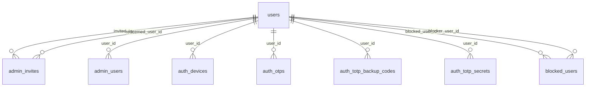
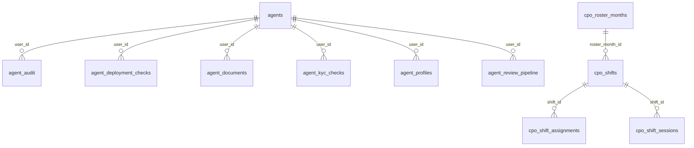
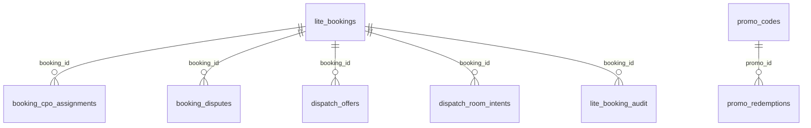
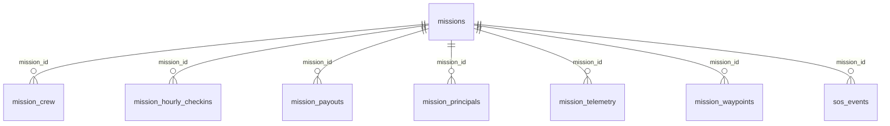
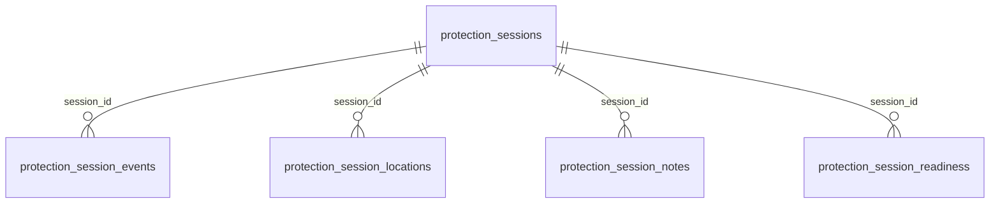
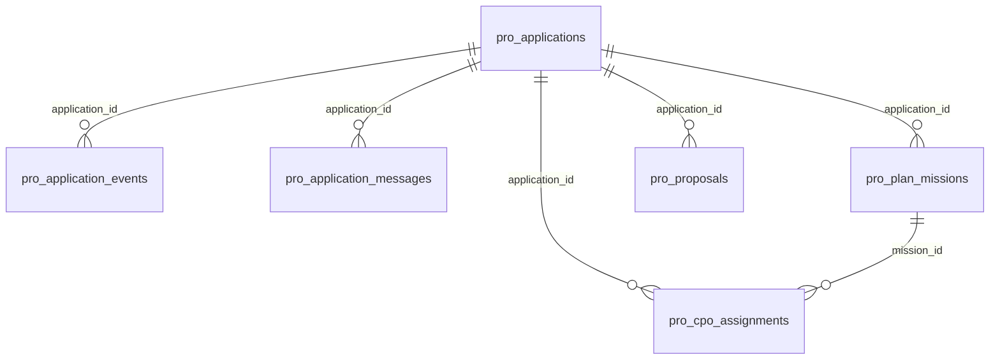
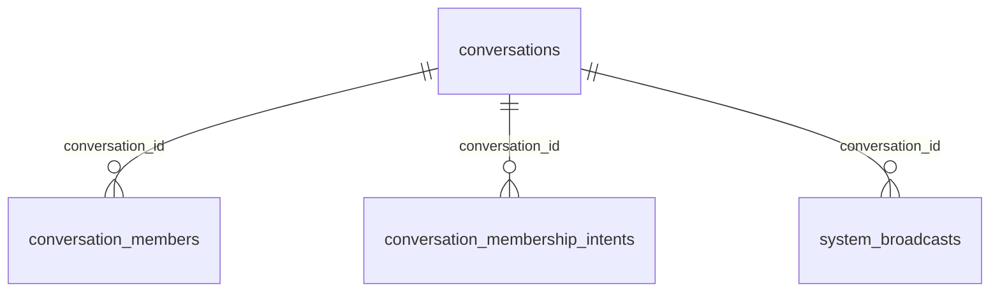
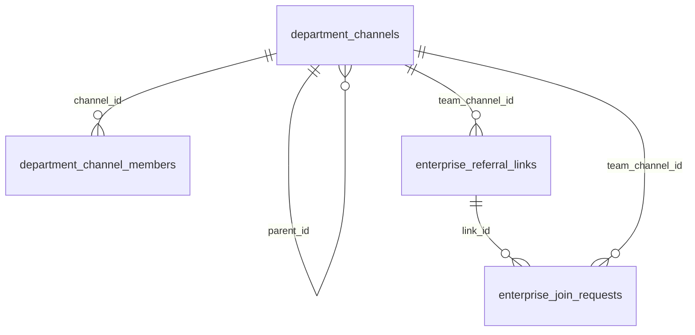
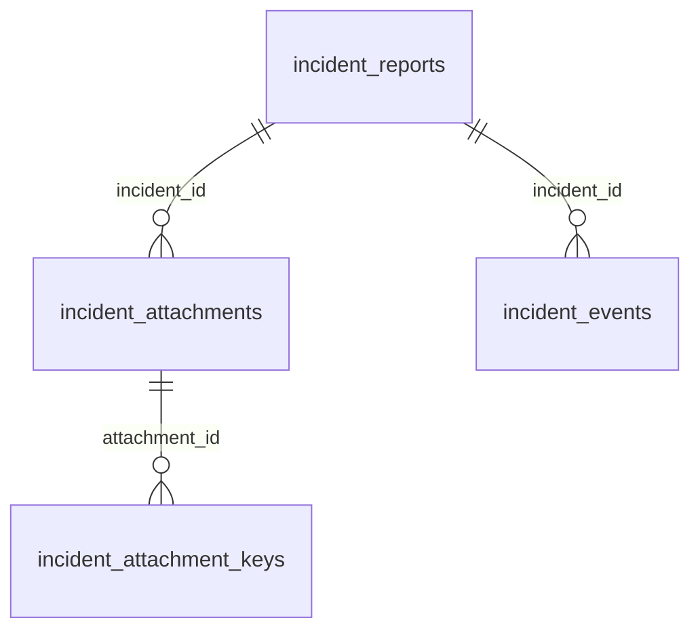
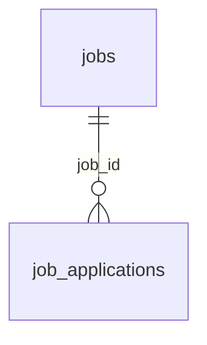

# 3. Database Architecture

**Bravo Secure — Technical Code & System Handover, Section 3**

|                         |                                                                                 |
| ----------------------- | ------------------------------------------------------------------------------- |
| **Document**            | Database Architecture                                                           |
| **Covers**              | Handover checklist §3, items 1–16                                               |
| **Companion documents** | [`03a_DATA_DICTIONARY.md`](03a_DATA_DICTIONARY.md) · [`schema.sql`](schema.sql) |
| **Prepared**            | 2026-08-21                                                                      |

> **How this document was produced.** Every name, type, constraint, index, trigger and
> count below was read directly out of a live PostgreSQL catalogue. The figures were then
> verified table-by-table against the running Supabase project by comparing a checksum of
> each table's column set — all 103 tables match.

---

## 3.1 Database technology and version

| Property     | Value                                                                                                  |
| ------------ | ------------------------------------------------------------------------------------------------------ |
| **Engine**   | PostgreSQL 17.6                                                                                        |
| **Platform** | Supabase — managed Postgres, PostgREST, Storage                                                        |
| **Project**  | `qkkfkicgoncxslbwhyhz` · `https://qkkfkicgoncxslbwhyhz.supabase.co`                                    |
| **Spatial**  | PostGIS 3.3 — `geography(Point, 4326)`                                                                 |
| **Access**   | TCP (`pg` pool) for the primary API; PostgREST over HTTPS for the messenger service and mobile Storage |

### Installed extensions

| Extension            | Purpose                                                  |
| -------------------- | -------------------------------------------------------- |
| `postgis`            | Geofences, CPO last-known position, job broadcast areas  |
| `pgcrypto`           | `gen_random_uuid()` — the default for every primary key  |
| `uuid-ossp`          | Legacy UUID generation                                   |
| `citext`             | Case-insensitive email and short-code columns            |
| `pg_trgm`            | Trigram search over names and call-signs                 |
| `btree_gist`         | Exclusion constraints combining scalar and range columns |
| `pg_stat_statements` | Query performance telemetry                              |
| `pg_net`             | Asynchronous HTTP from the database                      |
| `supabase_vault`     | Platform-managed secret storage                          |
| `plpgsql`            | Trigger and function language                            |

### Schemas

| Schema                                                                    |  Tables | Owner                                                                         |
| ------------------------------------------------------------------------- | ------: | ----------------------------------------------------------------------------- |
| `public`                                                                  | **103** | Bravo Secure application — the subject of this document                       |
| `auth`                                                                    |      23 | Supabase GoTrue — retained by the platform, unused by the application (§3.12) |
| `storage`                                                                 |      10 | Supabase Storage — avatars, KYC uploads, message media                        |
| `supabase_migrations`                                                     |       1 | Migration ledger                                                              |
| `net`, `vault`, `supabase_functions`, `realtime`, `graphql`, `extensions` |     0–2 | Supabase platform internals                                                   |

---

## 3.2 Database access

| Consumer                              | Path                                                                | Connects as              | Row-level security                    |
| ------------------------------------- | ------------------------------------------------------------------- | ------------------------ | ------------------------------------- |
| **`apps/auth-service`** (NestJS)      | Direct TCP, `pg` connection pool                                    | `postgres`               | Bypassed — holds `BYPASSRLS`          |
| **`apps/messenger-service`** (NestJS) | PostgREST over HTTPS, `@supabase/supabase-js`                       | `service_role`           | Bypassed                              |
| **Mobile app** (React Native)         | Supabase Storage only; PostgREST reachable with the public anon key | `anon` / `authenticated` | Enforced — every table denies (§3.12) |
| **Ops Console** (Next.js)             | HTTP to `auth-service`; never reaches Postgres                      | —                        | —                                     |
| **Operators**                         | Supabase Dashboard SQL editor, or `psql` via the pooler             | project owner            | Bypassed                              |

Credentials are supplied by environment variable:

| Service             | Variables                                                                                                      |
| ------------------- | -------------------------------------------------------------------------------------------------------------- |
| `auth-service`      | `DATABASE_URL`                                                                                                 |
| `messenger-service` | `SUPABASE_URL`, `SUPABASE_SERVICE_ROLE_KEY` — required in production; the process refuses to boot without them |
| Mobile              | `EXPO_PUBLIC_SUPABASE_URL`, `EXPO_PUBLIC_SUPABASE_ANON_KEY` (`src/utils/constants.ts`)                         |

> The anon key is public by design and ships inside the Android package. It is safe
> because row-level security denies the `anon` role on every table — see §3.12.

### Connection pooling and transactions

`apps/auth-service/src/database/database.service.ts` owns a single `pg.Pool`, created on
module init and drained on shutdown. It exposes a narrow `Tx` interface — `q` (all rows)
and `qOne` (first row or `null`) — satisfied identically by the pool and by a checked-out
client, so a service method can run standalone or inside a transaction without change.

`withTransaction(fn)` issues `BEGIN`, commits on success, rolls back and re-throws on
error, and always releases the client in `finally` so a thrown exception cannot pin a
connection. Row locking inside the callback uses `SELECT … FOR UPDATE`; this is what stops
two operators approving the same booking simultaneously.

There is **no ORM**. All access is parameterised SQL.

---

## 3.3 Current database schema

The complete DDL is [`schema.sql`](schema.sql) — `pg_dump --schema-only`, covering every
schema (`public`, `auth`, `storage`, `realtime`, `graphql`, `vault`, `net`,
`supabase_functions`): 11,554 lines, 139 `CREATE TABLE` statements.

### Object inventory — `public` schema

|                                 Object | Count                        |
| -------------------------------------: | ---------------------------- |
|                                 Tables | **103**                      |
|                                Columns | **1,106**                    |
|                                Indexes | **296** — 293 B-tree, 3 GiST |
|                           Foreign keys | **148**                      |
|                      Check constraints | **75**                       |
|                     Unique constraints | **26**                       |
|                             Enum types | **16**                       |
|                              Functions | **17**                       |
|                               Triggers | **19**                       |
|                                  Views | **0**                        |
| Tables with row-level security enabled | **103 / 103**                |

Counts exclude PostGIS's own `spatial_ref_sys`.

---

## 3.4 ER diagrams

103 tables do not fit in one readable diagram, so the model is drawn per domain. Each
diagram shows the foreign keys _within_ that domain; keys crossing into another domain are
listed in the table beneath it.

`users` is the hub of the entire schema — **86 of the 148 foreign keys point at it.**

### Authentication & Identity



### Agents / CPO Workforce



_No intra-domain foreign keys:_ `cpo_pool`, `compliance_credentials`, `armed_authorizations`, `vehicle_pool`

**Outbound references to other domains**

| From                      | Column              | References                                | On delete |
| ------------------------- | ------------------- | ----------------------------------------- | --------- |
| `agent_deployment_checks` | `mission_id`        | `missions` _(Missions & Live Operations)_ | CASCADE   |
| `agents`                  | `managed_by_org_id` | `users` _(Authentication & Identity)_     | NO ACTION |
| `cpo_roster_months`       | `created_by`        | `users` _(Authentication & Identity)_     | NO ACTION |
| `cpo_roster_months`       | `org_user_id`       | `users` _(Authentication & Identity)_     | CASCADE   |
| `cpo_roster_months`       | `published_by`      | `users` _(Authentication & Identity)_     | NO ACTION |
| `cpo_shift_assignments`   | `cpo_user_id`       | `users` _(Authentication & Identity)_     | CASCADE   |
| `cpo_shift_sessions`      | `cpo_user_id`       | `users` _(Authentication & Identity)_     | CASCADE   |
| `cpo_shift_sessions`      | `edited_by`         | `users` _(Authentication & Identity)_     | NO ACTION |
| `cpo_shift_sessions`      | `org_user_id`       | `users` _(Authentication & Identity)_     | CASCADE   |
| `cpo_shift_sessions`      | `reviewed_by`       | `users` _(Authentication & Identity)_     | NO ACTION |
| `cpo_shifts`              | `created_by`        | `users` _(Authentication & Identity)_     | NO ACTION |
| `cpo_shifts`              | `org_user_id`       | `users` _(Authentication & Identity)_     | CASCADE   |

### Booking (Lite & Secure)



_No intra-domain foreign keys:_ `lite_booking_add_ons`, `dispatch_room_crypto_claims`

**Outbound references to other domains**

| From                          | Column             | References                                             | On delete |
| ----------------------------- | ------------------ | ------------------------------------------------------ | --------- |
| `booking_cpo_assignments`     | `cpo_id`           | `cpo_pool` _(Agents / CPO Workforce)_                  | NO ACTION |
| `dispatch_room_crypto_claims` | `claimed_by`       | `users` _(Authentication & Identity)_                  | NO ACTION |
| `dispatch_room_crypto_claims` | `conversation_id`  | `conversations` _(Messenger & E2EE Transport)_         | CASCADE   |
| `dispatch_room_intents`       | `member_user_id`   | `users` _(Authentication & Identity)_                  | CASCADE   |
| `dispatch_room_intents`       | `org_user_id`      | `users` _(Authentication & Identity)_                  | CASCADE   |
| `dispatch_room_intents`       | `requested_by`     | `users` _(Authentication & Identity)_                  | NO ACTION |
| `lite_bookings`               | `referral_code_id` | `provider_referral_codes` _(Organisations & Channels)_ | SET NULL  |

### Missions & Live Operations



_No intra-domain foreign keys:_ `mission_telemetry_last`, `live_feed_events`

**Outbound references to other domains**

| From                      | Column             | References                                     | On delete |
| ------------------------- | ------------------ | ---------------------------------------------- | --------- |
| `mission_crew`            | `agent_id`         | `agents` _(Agents / CPO Workforce)_            | RESTRICT  |
| `mission_hourly_checkins` | `booking_id`       | `lite_bookings` _(Booking (Lite & Secure))_    | CASCADE   |
| `mission_payouts`         | `booking_id`       | `lite_bookings` _(Booking (Lite & Secure))_    | CASCADE   |
| `mission_payouts`         | `payee_user_id`    | `users` _(Authentication & Identity)_          | NO ACTION |
| `mission_telemetry_last`  | `booking_id`       | `lite_bookings` _(Booking (Lite & Secure))_    | CASCADE   |
| `missions`                | `booking_id`       | `lite_bookings` _(Booking (Lite & Secure))_    | CASCADE   |
| `missions`                | `comms_channel_id` | `conversations` _(Messenger & E2EE Transport)_ | SET NULL  |
| `sos_events`              | `resolved_by`      | `users` _(Authentication & Identity)_          | NO ACTION |
| `sos_events`              | `user_id`          | `users` _(Authentication & Identity)_          | NO ACTION |

### Protection Sessions



_No intra-domain foreign keys:_ `protection_access_audit`

**Outbound references to other domains**

| From                  | Column           | References                                           | On delete |
| --------------------- | ---------------- | ---------------------------------------------------- | --------- |
| `protection_sessions` | `application_id` | `pro_applications` _(Secure Pro (Subscriptions))_    | NO ACTION |
| `protection_sessions` | `assignment_id`  | `pro_cpo_assignments` _(Secure Pro (Subscriptions))_ | NO ACTION |

### Secure Pro (Subscriptions)



_No intra-domain foreign keys:_ `subscription_prices`

**Outbound references to other domains**

| From                  | Column       | References                            | On delete |
| --------------------- | ------------ | ------------------------------------- | --------- |
| `subscription_prices` | `updated_by` | `users` _(Authentication & Identity)_ | NO ACTION |

### Messenger & E2EE Transport



_No intra-domain foreign keys:_ `sealed_envelope_archive`, `signal_identities`, `signal_one_time_prekeys`, `notifications`, `channel_membership_intents`

**Outbound references to other domains**

| From                              | Column              | References                                         | On delete |
| --------------------------------- | ------------------- | -------------------------------------------------- | --------- |
| `channel_membership_intents`      | `channel_id`        | `department_channels` _(Organisations & Channels)_ | CASCADE   |
| `channel_membership_intents`      | `member_user_id`    | `users` _(Authentication & Identity)_              | CASCADE   |
| `channel_membership_intents`      | `requested_by`      | `users` _(Authentication & Identity)_              | NO ACTION |
| `conversation_members`            | `user_id`           | `users` _(Authentication & Identity)_              | CASCADE   |
| `conversation_membership_intents` | `member_user_id`    | `users` _(Authentication & Identity)_              | CASCADE   |
| `conversation_membership_intents` | `requested_by`      | `users` _(Authentication & Identity)_              | NO ACTION |
| `conversations`                   | `created_by`        | `users` _(Authentication & Identity)_              | NO ACTION |
| `sealed_envelope_archive`         | `recipient_user_id` | `users` _(Authentication & Identity)_              | CASCADE   |
| `signal_identities`               | `user_id`           | `users` _(Authentication & Identity)_              | CASCADE   |
| `signal_one_time_prekeys`         | `user_id`           | `users` _(Authentication & Identity)_              | CASCADE   |
| `system_broadcasts`               | `created_by`        | `users` _(Authentication & Identity)_              | NO ACTION |

### Backup & Merkle Integrity

```mermaid
erDiagram
```

_No intra-domain foreign keys:_ `backup_merkle_commits`, `backup_session_snapshots`, `conversation_backups`, `identity_backups`, `messages_backup`

**Outbound references to other domains**

| From                       | Column          | References                            | On delete |
| -------------------------- | --------------- | ------------------------------------- | --------- |
| `backup_merkle_commits`    | `user_id`       | `users` _(Authentication & Identity)_ | CASCADE   |
| `backup_session_snapshots` | `user_id`       | `users` _(Authentication & Identity)_ | CASCADE   |
| `conversation_backups`     | `owner_user_id` | `users` _(Authentication & Identity)_ | CASCADE   |
| `identity_backups`         | `user_id`       | `users` _(Authentication & Identity)_ | CASCADE   |
| `messages_backup`          | `owner_user_id` | `users` _(Authentication & Identity)_ | CASCADE   |

### Organisations & Channels



_No intra-domain foreign keys:_ `org_workspaces`, `org_members`, `org_workspace_settings`, `org_audit_log`, `provider_invite_codes`, `provider_referral_codes`

**Outbound references to other domains**

| From                         | Column              | References                            | On delete |
| ---------------------------- | ------------------- | ------------------------------------- | --------- |
| `department_channel_members` | `user_id`           | `users` _(Authentication & Identity)_ | CASCADE   |
| `department_channels`        | `created_by`        | `users` _(Authentication & Identity)_ | CASCADE   |
| `department_channels`        | `name_changed_by`   | `users` _(Authentication & Identity)_ | NO ACTION |
| `department_channels`        | `org_id`            | `users` _(Authentication & Identity)_ | CASCADE   |
| `enterprise_join_requests`   | `applicant_user_id` | `users` _(Authentication & Identity)_ | CASCADE   |
| `enterprise_join_requests`   | `decided_by`        | `users` _(Authentication & Identity)_ | SET NULL  |
| `enterprise_join_requests`   | `org_user_id`       | `users` _(Authentication & Identity)_ | CASCADE   |
| `enterprise_join_requests`   | `referrer_user_id`  | `users` _(Authentication & Identity)_ | SET NULL  |
| `enterprise_referral_links`  | `accepted_by`       | `users` _(Authentication & Identity)_ | SET NULL  |
| `enterprise_referral_links`  | `created_by`        | `users` _(Authentication & Identity)_ | SET NULL  |
| `enterprise_referral_links`  | `org_user_id`       | `users` _(Authentication & Identity)_ | CASCADE   |
| `enterprise_referral_links`  | `referrer_user_id`  | `users` _(Authentication & Identity)_ | SET NULL  |
| `org_audit_log`              | `actor_id`          | `users` _(Authentication & Identity)_ | NO ACTION |
| `org_audit_log`              | `org_user_id`       | `users` _(Authentication & Identity)_ | CASCADE   |
| `org_members`                | `invited_by`        | `users` _(Authentication & Identity)_ | NO ACTION |
| `org_members`                | `member_user_id`    | `users` _(Authentication & Identity)_ | CASCADE   |
| `org_members`                | `org_user_id`       | `users` _(Authentication & Identity)_ | CASCADE   |
| `org_members`                | `suspended_by`      | `users` _(Authentication & Identity)_ | NO ACTION |
| `org_workspace_settings`     | `org_user_id`       | `users` _(Authentication & Identity)_ | CASCADE   |
| `org_workspace_settings`     | `updated_by`        | `users` _(Authentication & Identity)_ | SET NULL  |
| `org_workspaces`             | `owner_user_id`     | `users` _(Authentication & Identity)_ | CASCADE   |
| `provider_invite_codes`      | `created_by`        | `users` _(Authentication & Identity)_ | SET NULL  |
| `provider_invite_codes`      | `org_user_id`       | `users` _(Authentication & Identity)_ | CASCADE   |
| `provider_invite_codes`      | `redeemed_by`       | `users` _(Authentication & Identity)_ | SET NULL  |
| `provider_referral_codes`    | `owner_user_id`     | `users` _(Authentication & Identity)_ | SET NULL  |

### Incidents & Attendance



_No intra-domain foreign keys:_ `attendance_corrections`

**Outbound references to other domains**

| From                       | Column              | References                            | On delete |
| -------------------------- | ------------------- | ------------------------------------- | --------- |
| `incident_attachment_keys` | `recipient_user_id` | `users` _(Authentication & Identity)_ | CASCADE   |
| `incident_attachments`     | `created_by`        | `users` _(Authentication & Identity)_ | NO ACTION |
| `incident_events`          | `actor_id`          | `users` _(Authentication & Identity)_ | NO ACTION |
| `incident_reports`         | `assigned_to`       | `users` _(Authentication & Identity)_ | NO ACTION |
| `incident_reports`         | `org_user_id`       | `users` _(Authentication & Identity)_ | CASCADE   |
| `incident_reports`         | `submitter_id`      | `users` _(Authentication & Identity)_ | NO ACTION |

### Wallet, Escrow & Billing

```mermaid
erDiagram
```

_No intra-domain foreign keys:_ `wallet_balances`, `wallet_transactions`, `wallet_credit_batches`, `escrow_holds`, `invoices`, `invoice_sequences`, `stripe_processed_events`

**Outbound references to other domains**

| From                  | Column       | References                                    | On delete |
| --------------------- | ------------ | --------------------------------------------- | --------- |
| `escrow_holds`        | `booking_id` | `lite_bookings` _(Booking (Lite & Secure))_   | NO ACTION |
| `escrow_holds`        | `offer_id`   | `dispatch_offers` _(Booking (Lite & Secure))_ | NO ACTION |
| `invoices`            | `booking_id` | `lite_bookings` _(Booking (Lite & Secure))_   | CASCADE   |
| `wallet_transactions` | `user_id`    | `users` _(Authentication & Identity)_         | NO ACTION |

### Family Hierarchy

```mermaid
erDiagram
```

_No intra-domain foreign keys:_ `family_members`, `family_member_locations`

**Outbound references to other domains**

| From                      | Column      | References                            | On delete |
| ------------------------- | ----------- | ------------------------------------- | --------- |
| `family_member_locations` | `user_id`   | `users` _(Authentication & Identity)_ | CASCADE   |
| `family_members`          | `holder_id` | `users` _(Authentication & Identity)_ | CASCADE   |
| `family_members`          | `member_id` | `users` _(Authentication & Identity)_ | CASCADE   |

### Virtual Bodyguard & Intel

```mermaid
erDiagram
```

_No intra-domain foreign keys:_ `vbg_monitoring`, `vbg_geofences`, `vbg_favorites`, `vbg_device_keys`, `vbg_telemetry_last`, `vbg_sra_snapshots`

**Outbound references to other domains**

| From                 | Column    | References                            | On delete |
| -------------------- | --------- | ------------------------------------- | --------- |
| `vbg_device_keys`    | `user_id` | `users` _(Authentication & Identity)_ | CASCADE   |
| `vbg_favorites`      | `user_id` | `users` _(Authentication & Identity)_ | CASCADE   |
| `vbg_geofences`      | `user_id` | `users` _(Authentication & Identity)_ | CASCADE   |
| `vbg_monitoring`     | `user_id` | `users` _(Authentication & Identity)_ | CASCADE   |
| `vbg_sra_snapshots`  | `user_id` | `users` _(Authentication & Identity)_ | CASCADE   |
| `vbg_telemetry_last` | `user_id` | `users` _(Authentication & Identity)_ | CASCADE   |

### Jobs Marketplace



**Outbound references to other domains**

| From               | Column                 | References                                  | On delete |
| ------------------ | ---------------------- | ------------------------------------------- | --------- |
| `job_applications` | `agent_id`             | `agents` _(Agents / CPO Workforce)_         | RESTRICT  |
| `job_applications` | `applicant_org_id`     | `users` _(Authentication & Identity)_       | NO ACTION |
| `job_applications` | `assigned_cpo_user_id` | `users` _(Authentication & Identity)_       | NO ACTION |
| `jobs`             | `booking_id`           | `lite_bookings` _(Booking (Lite & Secure))_ | CASCADE   |

---

## 3.5 Major tables

The 103 tables group into 15 functional domains.

| Domain                     | Tables | Anchor table            |
| -------------------------- | -----: | ----------------------- |
| Authentication & Identity  |      8 | `users`                 |
| Agents / CPO Workforce     |     15 | `agents`                |
| Booking (Lite & Secure)    |     10 | `lite_bookings`         |
| Missions & Live Operations |     10 | `missions`              |
| Protection Sessions        |      6 | `protection_sessions`   |
| Secure Pro (Subscriptions) |      7 | `pro_applications`      |
| Messenger & E2EE Transport |      9 | `conversations`         |
| Backup & Merkle Integrity  |      5 | `backup_merkle_commits` |
| Organisations & Channels   |     10 | `org_workspaces`        |
| Incidents & Attendance     |      5 | `incident_reports`      |
| Wallet, Escrow & Billing   |      7 | `wallet_balances`       |
| Family Hierarchy           |      2 | `family_members`        |
| Virtual Bodyguard & Intel  |      6 | `vbg_monitoring`        |
| Jobs Marketplace           |      2 | `jobs`                  |
| Audit & Compliance         |      1 | `ops_audit`             |

### The tables that carry the business

| Table                 | Role                                                                                | Inbound FKs |
| --------------------- | ----------------------------------------------------------------------------------- | ----------: |
| `users`               | Every human identity — clients, CPOs, operators, admins. The root of the graph.     |          86 |
| `lite_bookings`       | Booking lifecycle; drives the `lite_booking_status` state machine.                  |          12 |
| `agents`              | CPO and agency profile, onboarding state (`agent_status`), and last-known position. |           8 |
| `missions`            | A confirmed booking in execution — crew, waypoints, telemetry, payout.              |           8 |
| `pro_applications`    | Secure Pro subscription applications → proposals → assignments.                     |           6 |
| `department_channels` | Organisation channel tree; depth and broadcast mode set by trigger.                 |           5 |
| `conversations`       | Messenger threads — 1:1, group, department and mission rooms.                       |           5 |
| `protection_sessions` | Live protection detail — subject location, readiness, access audit.                 |           4 |
| `wallet_balances`     | Bravo Credits balance; `wallet_transactions` is the ledger behind it.               |           — |

### Lifecycle state machines

| Enum                    | Flow                                                                                                                                                                | Enforced by                       |
| ----------------------- | ------------------------------------------------------------------------------------------------------------------------------------------------------------------- | --------------------------------- |
| `lite_booking_status`   | `DRAFT` → `PENDING_OPS` → `OPS_APPROVED` → `PAYMENT_PENDING` → `CONFIRMED` → `LIVE` → `COMPLETED`, with `CANCELLED`, `DISPATCHING`, `NO_PROVIDER`, `AGENCY_NO_SHOW` | `lite_bookings_fsm_check` trigger |
| `mission_status`        | `DISPATCHED` → `PICKUP` → `LIVE` → `COMPLETED`, with `SOS`, `ABORTED`                                                                                               | `missions_fsm_check` trigger      |
| `agent_status`          | `DRAFT` → `PROFILE_COMPLETE` → `KYC_PENDING` → `DOCS_PENDING` → `SUBMITTED` → `UNDER_REVIEW` → `APPROVED` / `REJECTED` → `ACTIVE`                                   | Application layer                 |
| `escrow_hold_status`    | `HELD` → `PENDING_RELEASE` → `RELEASED` / `REFUNDED`, with `PARTIAL`, `DISPUTED`                                                                                    | Application layer                 |
| `dispatch_offer_status` | `OFFERED` → `ACCEPTED` / `REJECTED` / `EXPIRED` / `SUPERSEDED` / `CANCELLED`                                                                                        | Application layer                 |

The booking and mission machines are enforced **in the database**, so an invalid
transition is rejected even from a direct SQL session. The trigger logic mirrors
`apps/auth-service/src/booking/state-machine.service.ts`, and a drift test
(`state-machine.drift.spec.ts`) parses the migration and fails the build if the two ever
disagree.

---

## 3.6 Table relationships

148 foreign keys. Structurally the schema is a star around `users`, with a few deep
operational chains:

```
users ──< lite_bookings ──< missions ──< mission_crew
                          │            ├─< mission_waypoints
                          │            ├─< mission_telemetry
                          │            ├─< mission_hourly_checkins
                          │            └─< mission_payouts
                          ├─< booking_cpo_assignments
                          ├─< lite_booking_add_ons
                          ├─< dispatch_offers
                          ├─< jobs ──< job_applications
                          └─< escrow_holds ──< invoices

users ──< org_members ──> org_workspaces ──< department_channels ──< department_channel_members
users ──< conversations ──< conversation_members
users ──< agents ──< agent_kyc_checks · agent_documents · agent_review_pipeline
users ──< wallet_balances ──< wallet_transactions · wallet_credit_batches
users ──< protection_sessions ──< protection_session_events · protection_session_locations
```

### Referential-action policy

| `ON DELETE` | Count | Applied to                                                    |
| ----------- | ----: | ------------------------------------------------------------- |
| `CASCADE`   |    92 | Owned detail rows that have no meaning without the parent     |
| `NO ACTION` |    36 | Deletion blocked while children exist                         |
| `SET NULL`  |    17 | Optional associations — an unassigned CPO, a detached mission |
| `RESTRICT`  |     3 | Explicit blocks on financial and roster references            |

All 148 constraints are **validated** — existing rows have been verified against every
constraint, not only new writes.

---

## 3.7 Primary and foreign keys

- **Every table has a primary key.** There are no heap tables.
- The dominant pattern is a surrogate `uuid PRIMARY KEY DEFAULT gen_random_uuid()`.
- Several tables are keyed on `user_id` directly — `agents`, `agent_profiles`,
  `wallet_balances`, `signal_identities` — because the row _is_ the user's record and a
  second one would be a bug.
- 26 additional `UNIQUE` constraints enforce business identity: one active membership per
  user, one redemption per user per promo code, one envelope per relay sequence, one job
  per booking, one document per `(user_id, slot)`.
- 155 of the 296 indexes are unique — roughly half the index surface exists to enforce
  identity rather than to accelerate reads.

Per-column `PK` / `FK` / `UQ` markers, the referenced table and the `ON DELETE` action are
given for every column in [`03a_DATA_DICTIONARY.md`](03a_DATA_DICTIONARY.md).

---

## 3.8 Views

**The schema contains no application views.** The only views present in `public`
(`geography_columns`, `geometry_columns`) are created by PostGIS.

All read shaping happens in the service layer as parameterised SQL. There is no business
logic hidden in view definitions.

---

## 3.9 Stored procedures, functions and triggers

17 functions and 19 triggers, in five groups.

### a) `updated_at` maintenance — 12 triggers

`touch_updated_at()` and four table-specific variants set `NEW.updated_at = now()` before
update. Wired to `users`, `agents`, `agent_profiles`, `lite_bookings`, `missions`,
`wallet_balances`, `signal_identities`, `backup_merkle_commits`,
`backup_session_snapshots`, `conversation_backups` and `identity_backups`.

### b) State-machine guards — 2 triggers

| Function                    | Table           | Enforces                                     |
| --------------------------- | --------------- | -------------------------------------------- |
| `lite_bookings_fsm_check()` | `lite_bookings` | Legal `lite_booking_status` transitions only |
| `missions_fsm_check()`      | `missions`      | Legal `mission_status` transitions only      |

### c) Immutability guards — 4 triggers

| Function                               | Table                    | Enforces                                         |
| -------------------------------------- | ------------------------ | ------------------------------------------------ |
| `ops_audit_no_mutation()`              | `ops_audit`              | Append-only — `UPDATE` and `DELETE` both refused |
| `attendance_corrections_append_only()` | `attendance_corrections` | No `UPDATE`                                      |
| `attendance_corrections_no_truncate()` | `attendance_corrections` | No `TRUNCATE`                                    |

These make the operator audit trail tamper-evident at the storage layer: a privileged
session cannot quietly rewrite history.

### d) Channel-tree derivation — 3 triggers on `department_channels`

`dept_channel_set_level()` derives channel depth from its parent,
`dept_channel_broadcast_mode()` forces broadcast semantics, and
`dept_channel_block_broadcast_delete()` refuses deletion of a broadcast channel.

### e) Domain functions — 4

| Function                       | Signature                                                                                                    | Purpose                                                                                               |
| ------------------------------ | ------------------------------------------------------------------------------------------------------------ | ----------------------------------------------------------------------------------------------------- |
| `has_free_cpo_capacity`        | `(p_agency uuid, p_needed int) → boolean`                                                                    | Whether an agency can staff a job now                                                                 |
| `is_eligible_for_dispatch`     | `(p_agency uuid, p_region text, p_requirements jsonb) → boolean`                                             | Whether an agency matches a dispatch offer                                                            |
| `put_identity_rotation_atomic` | `(p_user_id, p_wrapped_master_key, p_salt, p_kdf_params, p_wrapped_identity_bundle, p_verifier_key) → jsonb` | Rotates a messenger identity bundle in a single transaction so a partial write cannot strand a device |
| `bump_backup_failed_attempts`  | `(p_user_id, p_max_attempts, p_lockout_sec) → TABLE(...)`                                                    | Server-side brute-force lockout for backup passphrase attempts                                        |

`bump_backup_failed_attempts` is the only `SECURITY DEFINER` routine in the schema, by
design: the attempt counter must not be resettable by its caller.

---

## 3.10 Indexing

296 indexes across 103 tables — a mean of 2.9 per table.

| Type               | Count | Used for                                                                   |
| ------------------ | ----: | -------------------------------------------------------------------------- |
| B-tree             |   293 | Keys, foreign keys, status filters, time ordering                          |
| GiST               |     3 | PostGIS geography — geofences, `agents.last_location`, job broadcast areas |
| _of which unique_  |   155 | Identity enforcement                                                       |
| _of which partial_ |    74 | Hot-subset indexes                                                         |

The heavy use of **partial indexes** — 25% of the total — is deliberate. Operational
queries almost always concern live rows (`WHERE status IN ('PUBLISHED','REVIEW')`,
`WHERE acknowledged_at IS NULL`, `WHERE suspended_at IS NOT NULL`), so the index stays
small as historical rows accumulate.

### Location and telemetry

Position data is written to three places, each with a different lifetime:

| Store                                                                 | Holds                                                 | Written by                                   |
| --------------------------------------------------------------------- | ----------------------------------------------------- | -------------------------------------------- |
| `mission_telemetry`                                                   | The mission's breadcrumb trail — full history         | `mission-lead.service.ts`                    |
| `mission_telemetry_last`                                              | Latest fix per booking, one row                       | `telemetry.service.ts`, `mission.service.ts` |
| `agents.last_lat` / `last_lng` / `last_location` / `last_location_at` | The CPO's last known position, for dispatch proximity | `agent.service.ts`                           |

The live map stream itself runs over Redis; Postgres holds the durable record. There is no
separate ping table — telemetry is mission-scoped.

Per-table index definitions are in the Data Dictionary.

---

## 3.11 Audit and history tables

Eleven tables record history, in four classes.

| Class                              | Tables                                                                                                     | Guarantee                                           |
| ---------------------------------- | ---------------------------------------------------------------------------------------------------------- | --------------------------------------------------- |
| **Append-only, database-enforced** | `ops_audit`, `attendance_corrections`                                                                      | `UPDATE` / `DELETE` / `TRUNCATE` refused by trigger |
| **Append-only by convention**      | `agent_audit`, `org_audit_log`, `lite_booking_audit`, `protection_access_audit`                            | Written once by the service layer                   |
| **Domain event streams**           | `incident_events`, `pro_application_events`, `protection_session_events`, `live_feed_events`, `sos_events` | Ordered event log per aggregate                     |
| **Idempotency ledger**             | `stripe_processed_events`                                                                                  | Prevents double-processing of payment webhooks      |

`protection_access_audit` is the compliance-critical one: it records **who viewed a
principal's location**, and is the evidence trail behind the protection-session privacy
model.

---

## 3.12 Database user permissions

Authorisation is deliberately split: the database denies everything to client-facing
roles, and the API layer grants.

### Row-level security

| Fact                        | Value         |
| --------------------------- | ------------- |
| Tables with RLS **enabled** | **103 / 103** |
| RLS **policies** defined    | **0**         |

RLS enabled with zero policies is **total deny**. The `anon` and `authenticated` roles can
neither read nor write any application table. This matters because the Supabase anon key
is embedded in the mobile package and PostgREST would otherwise expose every table in
`public` to anyone holding it. The mobile client therefore uses Supabase for **Storage
only**; all data access goes through `auth-service`.

A migration-level assertion re-checks the whole catalogue and fails the deployment if any
application table is ever left without RLS, so a newly added table cannot silently ship
unprotected. Supabase's own security advisor reports **zero** ERROR-level findings against
the project.

> Adding an RLS policy to make something work directly from the mobile client would
> undo this. The correct change is an `auth-service` endpoint.

### Effective roles

| Role            | Reaches data via                   | RLS                       |
| --------------- | ---------------------------------- | ------------------------- |
| `postgres`      | `auth-service` connection pool     | Bypassed (`rolbypassrls`) |
| `service_role`  | `messenger-service` over PostgREST | Bypassed                  |
| `authenticated` | Mobile PostgREST                   | Enforced — denied         |
| `anon`          | Mobile PostgREST (public key)      | Enforced — denied         |

### Application-level authorisation

Because the database grants nothing to client roles, authorisation lives in
`auth-service`:

- `admin_role` — `OPS` / `SUPERVISOR` / `ADMIN`, held in `admin_users`
- `org_members.role` with `manager_scope_root_ids` for organisation and department scoping
- JWT access and refresh tokens bound to a device (`auth_devices`), with TOTP
  (`auth_totp_secrets`, `auth_totp_backup_codes`) and one-time codes (`auth_otps`)
- `users.suspended_at` — a reversible account lockout checked on login, verify and refresh,
  distinct from the irreversible `deleted_at` erasure tombstone

The platform `auth` schema is retained by Supabase but unused — the application owns
identity end to end, including password hashing and token issuance.

---

## 3.13 Backup process

Full procedures, commands and verification steps are in
[`docs/runbooks/DATABASE_BACKUP_RESTORE.md`](../runbooks/DATABASE_BACKUP_RESTORE.md).

| Layer                        | Mechanism                                                                                                                           |
| ---------------------------- | ----------------------------------------------------------------------------------------------------------------------------------- |
| **Automated**                | Supabase platform daily backups, with point-in-time recovery available per plan                                                     |
| **On-demand logical backup** | `supabase db dump` — separate schema, data and role dumps, taken before any risky operation                                         |
| **Schema definition**        | Held in git as 148 migrations; an empty database can be rebuilt from the repository alone                                           |
| **Object storage**           | Avatars, KYC documents and message media live in Supabase Storage and are copied separately — they are not contained in a `pg_dump` |

> Distinct from [`BACKUP_LOOP.md`](../runbooks/BACKUP_LOOP.md), which covers users'
> end-to-end-encrypted _message_ archives. That is an application feature, not a database
> backup, and the two protect different things.

---

## 3.14 Database restoration procedure

Three paths, in increasing order of severity — all detailed in the runbook.

### a) Platform restore

**Dashboard → Database → Backups → Restore.** The normal path for accidental mass deletion
or corruption. It replaces current state, so a fresh logical dump is taken first even
during an incident.

### b) Logical restore into a fresh project

For disaster recovery or rehearsal — restore `schema.sql` then the data dump into a new
project with `psql -v ON_ERROR_STOP=1`, confirm the migration ledger transferred, then
repoint the services.

### c) Rebuild the schema from the repository

For a clean environment with no data to preserve:

```bash
npx supabase start && npx supabase db reset     # local
npx supabase db reset --linked                  # remote — destructive
```

This replays all 148 migrations from empty and reproduces the production schema exactly.

### Verifying a restore

```sql
select count(*) from pg_tables where schemaname = 'public';           -- 104 incl. PostGIS
select count(*) from supabase_migrations.schema_migrations;           -- 148
select count(*) from pg_class c                                       -- 0
 where c.relnamespace = 'public'::regnamespace
   and c.relkind in ('r','p') and not c.relrowsecurity
   and not exists (select 1 from pg_depend d where d.objid = c.oid and d.deptype = 'e');
```

The runbook schedules a quarterly rehearsal against a scratch project, ending in a full
booking flow, so the procedure is proven rather than assumed.

---

## 3.15 Migration and versioning process

### Layout

```
supabase/migrations/
  20260416000000_init_phase1.sql
  20260416120000_custom_auth.sql
  …
  20260821120000_reconcile_out_of_band_changes.sql      # 148 files
```

- Naming: `YYYYMMDDHHMMSS_snake_case_description.sql`; timestamps are unique, so
  lexicographic order is chronological order.
- Applied in that order; the ledger is `supabase_migrations.schema_migrations`.
- **Forward-only.** To undo a change, write a migration that reverses it.
- Migrations are written to be idempotent wherever practical, so a re-apply is a no-op.

### Deployment

`.github/workflows/deploy-migrations.yml` runs on any push to `main` touching
`supabase/migrations/**`:

```
supabase link --project-ref qkkfkicgoncxslbwhyhz
supabase db push --include-all
```

`SUPABASE_ACCESS_TOKEN` and `SUPABASE_DB_PASSWORD` are repository secrets, and a
`concurrency` group ensures two applies can never race the ledger.

### Confirming the database matches the repository

```bash
npx supabase db diff --linked --schema public      # empty output == no drift
```

This is the authoritative drift check and should be run after every deployment and before
any destructive migration. Anything it reports is a change made outside the migration
tree, and must be written back as a migration.

### Local development

```bash
npx supabase start                       # boot the local stack
npx supabase migration new <name>        # create a timestamped file
npx supabase db reset                    # rebuild local from the whole tree
npx supabase db diff -f <name>           # capture local changes as a migration
```

---

## 3.16 Data Dictionary

The complete column-level dictionary is
**[`03a_DATA_DICTIONARY.md`](03a_DATA_DICTIONARY.md)** — all 103 tables and 1,106 columns,
grouped by domain, each column with its type, nullability, default, `PK`/`FK`/`UQ` markers,
referenced table and `ON DELETE` action, followed by that table's check constraints,
indexes, triggers and RLS status.

### Enumerated types

| Enum                    | Values                                                                                                                                                                                                                                                                                                 |
| ----------------------- | ------------------------------------------------------------------------------------------------------------------------------------------------------------------------------------------------------------------------------------------------------------------------------------------------------ |
| `admin_role`            | `OPS`, `SUPERVISOR`, `ADMIN`                                                                                                                                                                                                                                                                           |
| `agent_check_state`     | `queued`, `running`, `done`, `failed`                                                                                                                                                                                                                                                                  |
| `agent_doc_state`       | `upload`, `done`, `rejected`                                                                                                                                                                                                                                                                           |
| `agent_status`          | `DRAFT`, `PROFILE_COMPLETE`, `KYC_PENDING`, `DOCS_PENDING`, `SUBMITTED`, `UNDER_REVIEW`, `APPROVED`, `REJECTED`, `ACTIVE`                                                                                                                                                                              |
| `agent_type`            | `company`, `cpo`, `transport`                                                                                                                                                                                                                                                                          |
| `application_status`    | `PENDING`, `SHORTLISTED`, `ASSIGNED`, `REJECTED`, `WITHDRAWN`                                                                                                                                                                                                                                          |
| `cpo_availability`      | `available`, `on_mission`, `off_duty`                                                                                                                                                                                                                                                                  |
| `dispatch_offer_status` | `OFFERED`, `ACCEPTED`, `REJECTED`, `EXPIRED`, `SUPERSEDED`, `CANCELLED`                                                                                                                                                                                                                                |
| `escrow_hold_status`    | `HELD`, `PENDING_RELEASE`, `RELEASED`, `REFUNDED`, `PARTIAL`, `DISPUTED`                                                                                                                                                                                                                               |
| `job_status`            | `PUBLISHED`, `REVIEW`, `ASSIGNED`, `DISPATCHED`, `CANCELLED`                                                                                                                                                                                                                                           |
| `lite_booking_status`   | `DRAFT`, `PENDING_OPS`, `OPS_APPROVED`, `PAYMENT_PENDING`, `CONFIRMED`, `LIVE`, `COMPLETED`, `CANCELLED`, `DISPATCHING`, `NO_PROVIDER`, `AGENCY_NO_SHOW`                                                                                                                                               |
| `mission_status`        | `DISPATCHED`, `PICKUP`, `LIVE`, `SOS`, `COMPLETED`, `ABORTED`                                                                                                                                                                                                                                          |
| `system_broadcast_kind` | `booking_submitted`, `booking_approved`, `booking_rejected`, `booking_cancelled`, `mission_started`, `mission_pickup`, `mission_live`, `mission_sos`, `mission_sos_ack`, `mission_sos_resolved`, `mission_abort`, `mission_complete`, `agent_approved`, `agent_rejected`, `payment_captured`, `custom` |
| `vehicle_status`        | `available`, `on_mission`, `maintenance`                                                                                                                                                                                                                                                               |
| `wallet_tx_status`      | `pending`, `succeeded`, `failed`, `refunded`                                                                                                                                                                                                                                                           |
| `wallet_tx_type`        | `topup`, `payment`, `refund`, `payout`, `expire`, `escrow_hold`, `escrow_refund`, `escrow_release`                                                                                                                                                                                                     |

---

## Checklist coverage — §3

|   # | Item                                          | Where                                                     |
| --: | --------------------------------------------- | --------------------------------------------------------- |
|   1 | Confirm database technology and version       | §3.1                                                      |
|   2 | Provide database access as applicable         | §3.2                                                      |
|   3 | Provide current database schema               | §3.3 · [`schema.sql`](schema.sql)                         |
|   4 | Provide ER diagram                            | §3.4                                                      |
|   5 | Explain major tables                          | §3.5                                                      |
|   6 | Explain table relationships                   | §3.6                                                      |
|   7 | Explain primary/foreign keys                  | §3.7                                                      |
|   8 | Explain views                                 | §3.8                                                      |
|   9 | Explain stored procedures/functions/triggers  | §3.9                                                      |
|  10 | Explain indexing                              | §3.10                                                     |
|  11 | Explain audit/history tables                  | §3.11                                                     |
|  12 | Explain database user permissions             | §3.12                                                     |
|  13 | Explain backup process                        | §3.13 · [runbook](../runbooks/DATABASE_BACKUP_RESTORE.md) |
|  14 | Demonstrate database restoration procedure    | §3.14 · [runbook](../runbooks/DATABASE_BACKUP_RESTORE.md) |
|  15 | Explain database migration/versioning process | §3.15                                                     |
|  16 | Provide Data Dictionary                       | [`03a_DATA_DICTIONARY.md`](03a_DATA_DICTIONARY.md)        |
